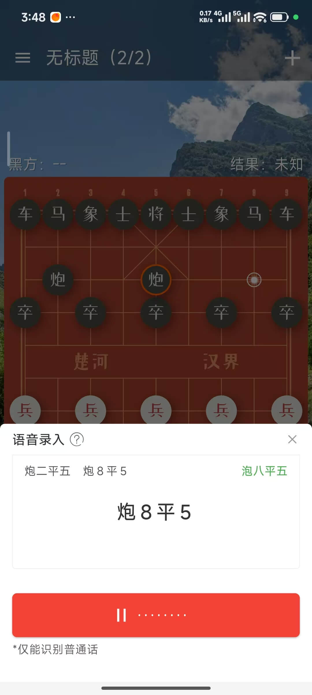

# 语音录入使用说明

> 语音录入是通过口述中文招法录入棋谱的一种便捷棋谱录入方法，目前仅能识别普通话，如遇到发音没有问题，却一直录入失败的情况，可以通过 [联系方式](https://static.cca.yhdm360.cn/faq/%E8%81%94%E7%B3%BB%E5%AE%A2%E6%9C%8D) 找到并反馈给我们。

### 使用方法

先切换到打谱页面，先准备好起始局面，再依次点击【菜单】-【高级录入】-【语音录入】即可打开语音录入面板。

点击开始录入，稍微等待一会，直到下方按钮中间显示暂停键，并且右侧显示声纹波动的时候，即可开始说话，录入招法，比如：你可以试试看对着手机说“马八进七“。

### 常见问题

### 1、识别失败怎么办？

如果遇到识别失败的情况，请使用标准普通话放慢语速再多试几次，通常都可以识别成功。

### 2、说不好普通话怎么办？

目前，语音录入仅能识别普通话，但不同城市的口音会导致部分文字发音不准，例如：四，有点地方会念成`shi`，甚至念成`ri`，这就可能导致识别失败。尽管我们已经尽可能兼容了这些场景，如果你遇到反复识别失败的场景，请务必附带截图反馈给我们，非常感谢您的支持！

### 3、为什么点击启动需要等待一段时间？

每次打开语音录入面板，首次点击启动都需要等待一段时间，这段时间大概在1到3秒之间，面板保持开启的情况下，点击停止/继续不用等待，这是因为准备资源通常需要一点时间，请耐心等待一下。
