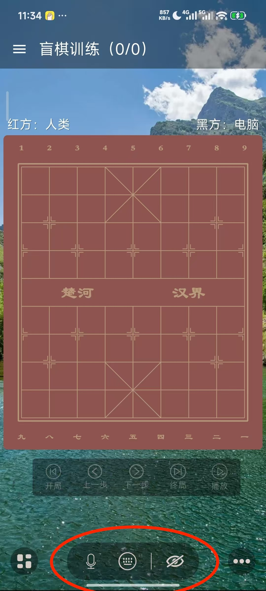
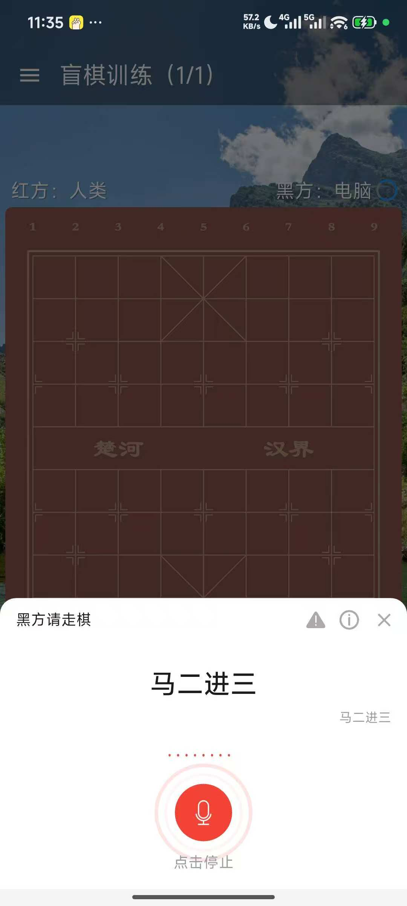
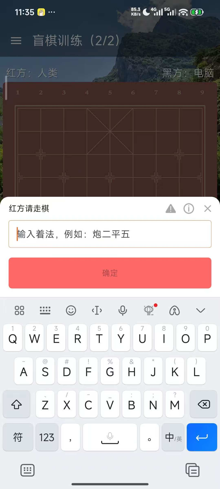
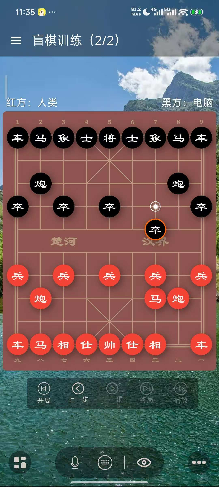
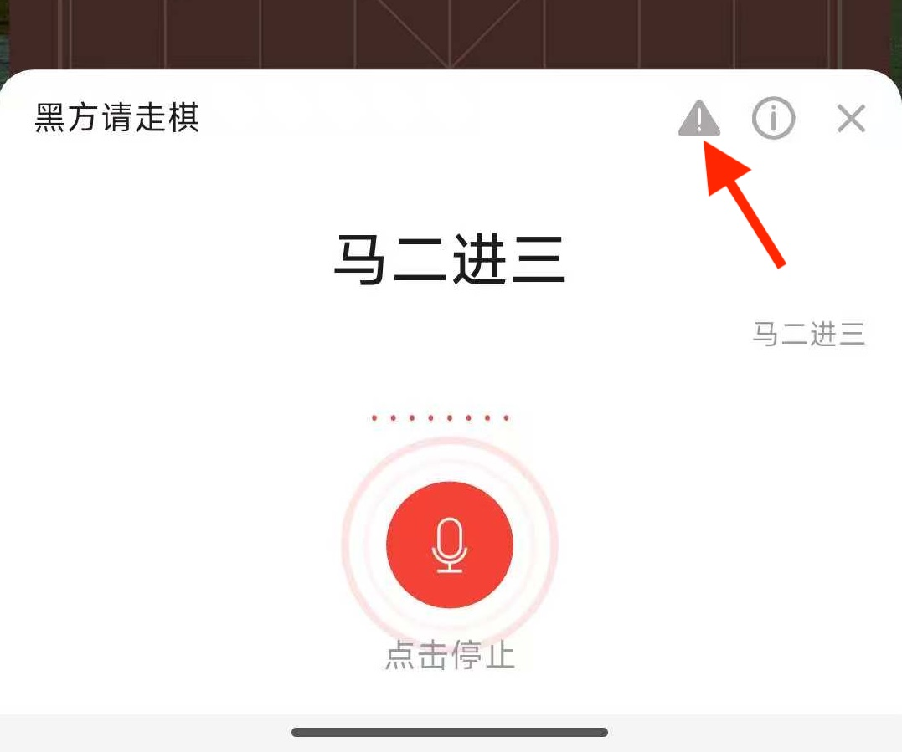

# 盲棋训练

盲棋训练是模拟中国象棋蒙目棋训练的一项功能。所谓的蒙目棋，也就是下棋的人需要闭着眼睛，通过语言下达指令走棋的一项运动。这通常需要第三者，也就是代为走棋的人，这在象棋助手里面极大简化了，不再需要走棋人，也不再需要播报员。开启象棋助手，一切搞定！

在象棋助手里面，我们把蒙目棋简称为盲棋。盲棋是一项非常考验脑力的运动，目前，中国象棋一对多人数最多的世界记录的创造者是蒋川，他当时创造的记录是1对26，也是至今仍未打破的世界吉尼斯记录。

由此可见，盲棋是一个非常具有吸引力的棋类运动，象棋助手将是第一个真正把盲棋数字化的软件。

### 功能简介

盲棋训练的核心当然是`语音识别`，但象棋助手除了提供语音操作之外，还额外提供了通过输入着法走棋的功能。接下来，我们就从`语音识别`和`文本输入`两个方面来给大家介绍盲棋训练功能的用法。

### 一、语音识别

打开象棋助手，切换到盲棋训练，你将看到如下页面：

在最下方正中间有三个按钮，分别是：语音识别、文本输入、显示/隐藏棋子。点击第一个按钮打开语音操作面板。

面板中间有一个红色按钮，点击按钮即可启动语音识别功能，每次打开面板，首次启动都需要等待1到2秒才能启动，请耐心等待一下。面板保持打开的情况下，停止后启动无需等待。

语音识别启动成功后，会听到”滴“的一声，表示你可以开始说话了，试试看对着麦克风说`马八进七`会发生什么。

在你着法输入正确的情况下，软件将自动走棋，走棋成功后。如果你设置的另外一方是电脑，那么，在电脑走棋完成后，象棋助手会把电脑方走棋的着法通过语音告诉你，并且同样会发出"滴"的一声告诉你可以开始走棋了。

**注意：一定是听到”滴“的声音结束后才开始说指令走棋**。

### 人类 VS 人类

除了与电脑下盲棋之外，象棋助手还支持你与朋友一起下盲棋。

为了与你的朋友一起下盲棋，你需要先将执棋选项全部设置为人类。在一方走棋完成后，软件会提示另一方走棋，同样会通过”滴“的一声告诉对方开始走棋。

由于是人与人对弈，通常双方都是面对面进行。因此，人走完棋后不会播报着法，因为本身就可以互相听见。这个时候软件的主要作用是：帮你判断你走的着法是否正确，以及当前棋局是否已经分出了胜负等等。

**1.1、其它指令**

语音识别除了支持常见着法指令之外，还支持一些比较实用的指令，比如：你可以在语音录入过程中说：

* `停止`，那么语音录入就会自动停止识别

* `认输`，这表示你想认输，游戏结束

* `重来`，这表示开启新的一盘棋

* `显示棋子`，这表示显示当前局面棋子，以便看到盘面

* `隐藏棋子`，这表示继续隐藏棋子

* `退出`，这表示退出语音识别

### 二、文本输入

如果你想通过输入着法的方式下盲棋，那么你需要点击第二个按钮，点击后会弹出着法输入面板。

接下来，你只需要输入着法进行走棋即可。同样地，电脑方走棋后，会通过语音播报告诉你。

注意：输入着法的方式走棋务必保证输入过程中不要出现错误，否则将导致走棋失败！

### 三、显示棋子

在一些情况下，你可能忘记了当前局面，导致无法继续。那么，你可以点击第三个按钮显示棋子，这样，你就可以直接看到当前盘面。

### 四、报错

如果你在使用过程中遇到了错误，可以点击语音录入面板右上角的三角形按钮上报错误给我们。

比如明明说的是正确的，却不走棋。或者识别始终错误的情况，都可以上报给我们。

### 五、常见问题

**5.1、明明感觉说的是正确的，为什么反复多次识别失败？**

语音识别并不是一个简单的功能，你可以仔细想一想，即便作为人类，你是不是也经常发出”啊“的疑问。那是因为语音中经常会出现发音非常相似的词语，很容易出现识别错误的问题。那么，为了保证识别准确度，这里我有几个建议给大家：

* 1）减慢语速，比如可以一个字一个字地说，保证字正腔圆

* 2）如果是`车`，假设你念`ju`的情况下始终识别失败，那不妨试试看念`che`

* 3）如果`炮`反复多次无法识别，那么你可以试试看念`bao`或者`gao`等等

