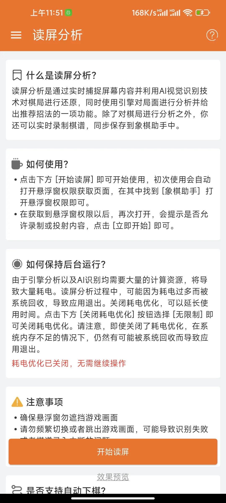
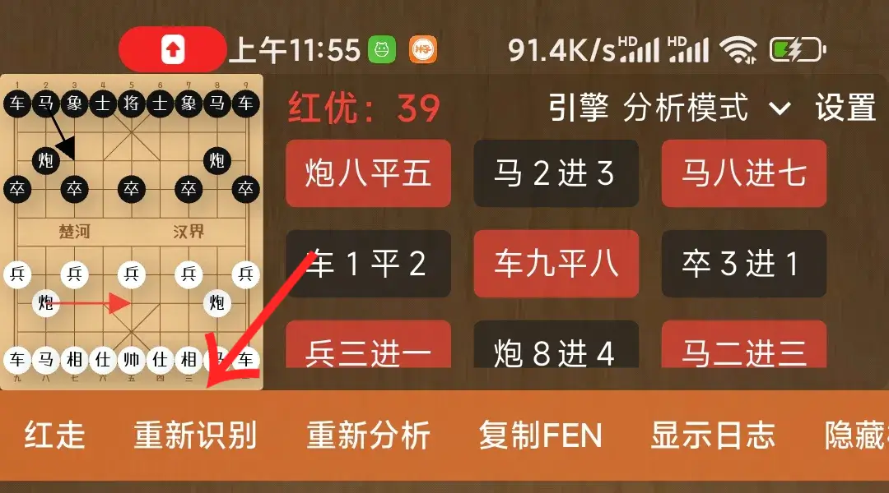
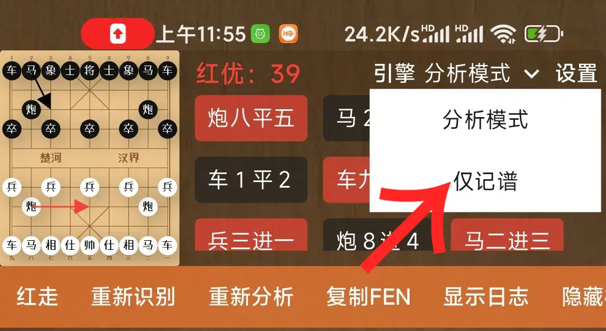
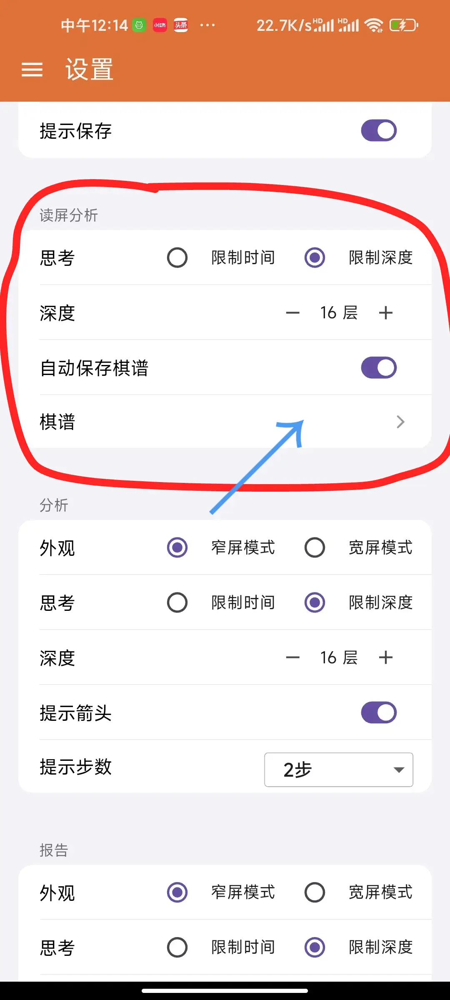

# 读屏分析使用指南
> 读屏分析是通过AI视觉识别技术对实时捕捉到的手机画面进行识别并利用引擎分析、打分以及给出招法推荐的功能。同时，你还可以实时录制棋谱到象棋助手，方便后续复盘分析。

### 前言
* 由于我们使用的是AI视觉识别技术，AI视觉识别就一定会有盲点。因此，识别遇到错误是非常正常的一件事情，请勿大惊小怪！
* 识别遇到错误，请参考下文章节，尝试再次识别！
* 由于AI视觉模型会占用大量的CPU以及内存，因此，你的手机性能越差，识别效果可能就越差。性能越好，识别速度以及效果就可能更佳。
* 尽管已经大幅改进了内存占用问题，但依然存在暂停问题，如遇到识别暂停问题，请参考下文章节进行处理！
* 不保证所有场景识别效果，我们并没有针对各种场景进行训练，例如，天天象棋的各种皮肤，或者其它的各种象棋软件等等。因此，并不保证能识别你任何一款app的画面。

### 如何使用
进入象棋助手首页后，手指轻按屏幕右滑，打开抽屉页面，选择读屏分析。

进入读屏分析页面后，如下图所示，你将看到一个详细的引导页，遇到问题，您可以先阅读该部分文档，查看是否有你想要的答案。

具体使用方法：

* 点击下方“开始读屏”按钮，由于“读屏分析”功能需要在手机屏幕上显示一个全局悬浮窗。所以，初次使用它会自动打开悬浮窗权限获取页面，打开后通常会看到一个软件列表，
在其中找到[象棋助手]点击打开悬浮窗使用权限。
* 获取到悬浮窗使用权限后，再次点击“开始读屏”按钮，会提示是否允许录制或投射内容，点击[立即开始]即可开始正常使用。
* 接下来，进入你想要读屏分析的棋局，例如说：你正在进行的天天象棋棋局，最上方的悬浮窗即会对当前局面进行实时分析并给出推荐招法。

### 关于读屏分析的准确性
象棋助手使用了目前主流的AI视觉识别技术对象棋局面进行识别，而AI视觉识别技术是通过投喂大量的棋局画面去训练AI以达到更好的识别效果。因此，这必然存在诸多盲点，
例如，光线、皮肤、清晰度、画面的其它因素等等均会影响识别效果。

因此，我们并不能保证100%的识别准确率，识别遇到错误是一件非常正常的事情，如果遇到错误，你可以参考以下章节，按照提示进行修正。

### 识别遇到错误怎么办？
如果识别遇到错误，你可以参考下图箭头指示，点击设置，打开设置面板。在设置面板里面找到[重新识别]等待一会即会重新识别。如果依然没有效果，可以先关闭读屏分析再重新打开试试看。

### 引擎没有正常分析怎么办？
部分情况下，可能会出现局面卡死，引擎未正常分析的情况。这种情况可能是AI识别以及引擎分析占用过多手机资源，导致识别卡顿，引擎分析暂停的情况。遇到这种情况，可以先关闭读屏分析，
等待一会再打开，或者完全杀掉象棋助手再重新打开。

### 记谱模式是什么？
记谱模式是在读屏分析的基础上，增加了自动录谱的功能。

### 录入的棋谱在哪里？
打开象棋助手，切换到设置页面，找到[读屏分析][棋谱]，点击打开，即可看到读屏分析过程中保存的棋谱。

**注意：该棋谱默认保存在本地，你需要自己打开，决定是否上传到象棋助手，只要同步过的棋谱才能在其它设备上看到。**

### 同一盘棋为什么会录入多次？
由于AI视觉识别偶尔会出现识别错误的情况，一旦识别错误，就会标记当前棋局为新的一盘棋。
这样，每次断开就会形成新的一个棋谱。因此，同一个棋局可能会录入多次，你需要自己参考棋谱，
整理成一个完整的棋局。

### 关于GIF动图识别
在我们的测试过程中发现，平均一个画面的识别时间基本都超过1秒，有的甚至会达到3到4秒（这是在红米手机上面的测试效果）。而GIF动图平均一张画面的切换时间大概在1秒左右。
因此，读屏分析识别到的画面可能会停留在前几帧，也就是跟不上画面的速度。推荐使用场景在一些画面切换速度没有那么频繁的场景！

### 已知问题
由于AI识别以及引擎分析均需要占用大量的CPU以及内存资源，这导致在一些手机上，如果一直开启引擎分析，
一段时间后可能会出现暂停一段时间的情况。这是由于AI识别在不断快速地消耗手机内存，导致应用出现了短暂的暂停问题。目前该问题我们已经进行了大量的优化，出现该问题的概率已经大幅度降低，但是该问题依然存在。如果遇到该问题，可以先退出读屏分析功能甚至杀掉应用，稍微等待几秒钟再打开应用或者读屏分析功能试试看。