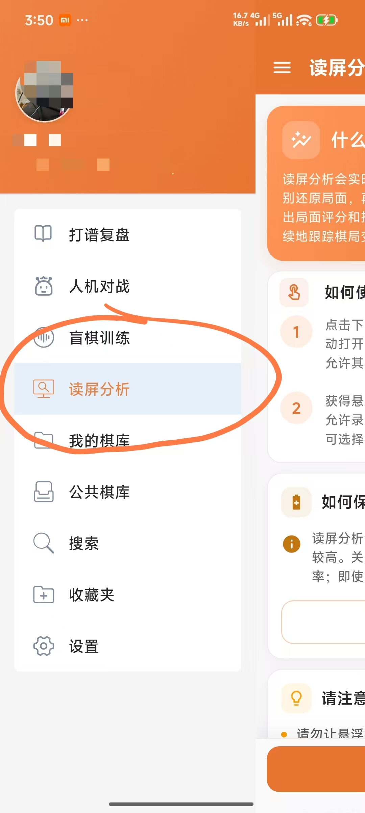
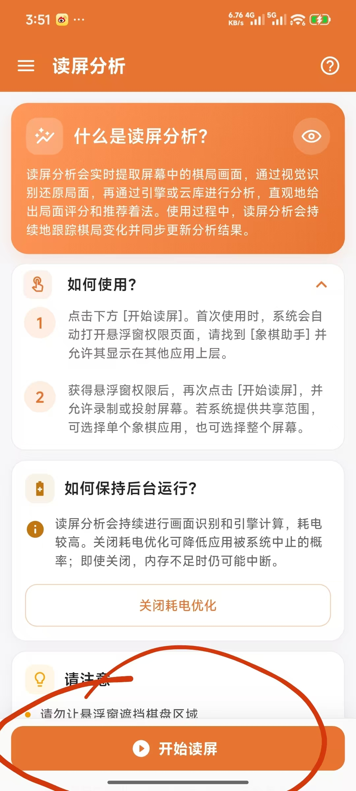
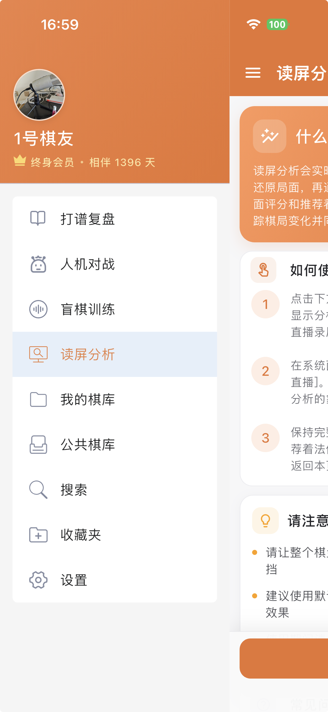
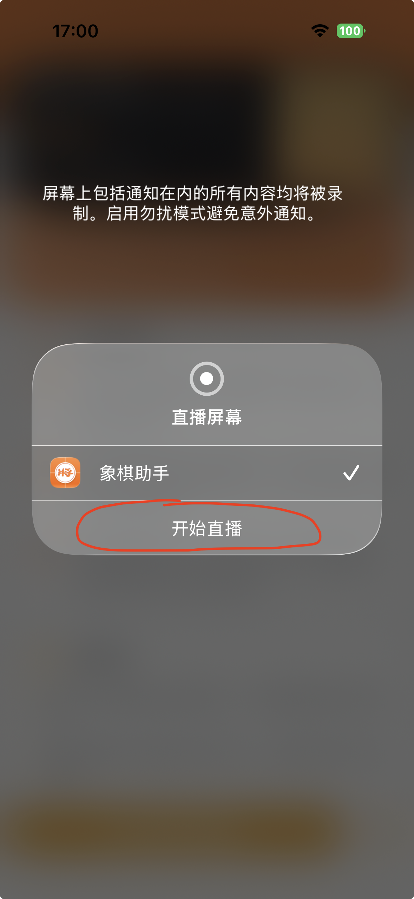
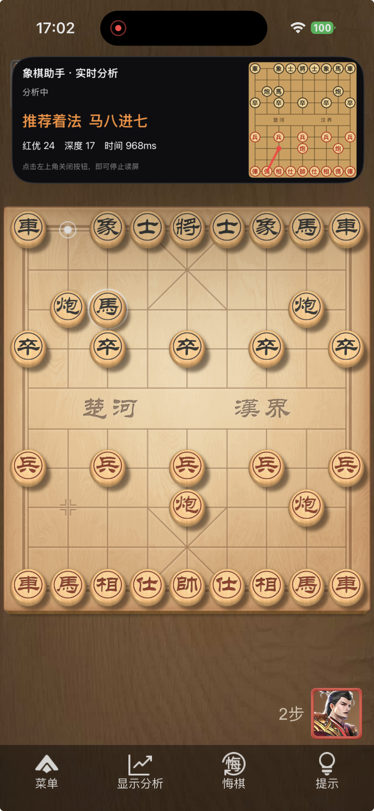
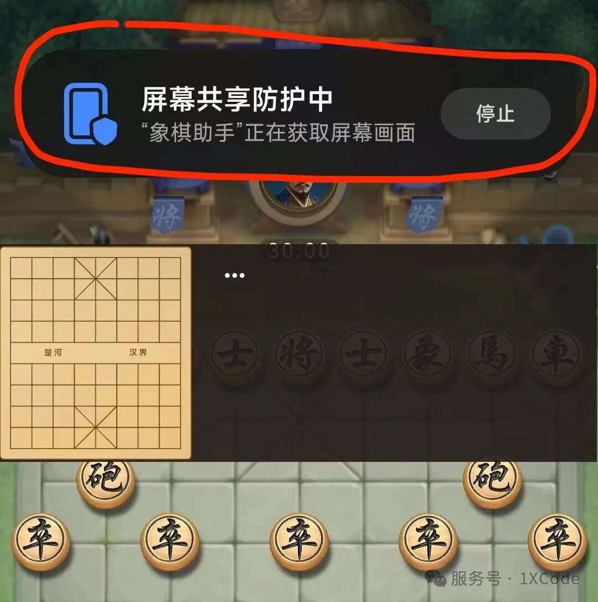
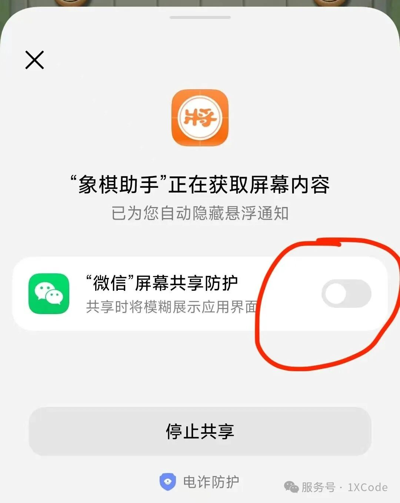
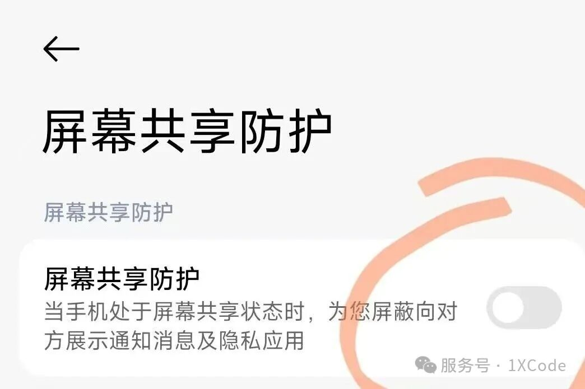

# 读屏分析使用指南

读屏分析会实时提取屏幕中的棋局画面，通过视觉识别还原局面，再通过引擎或云库进行分析，直观地给出局面评分和推荐着法。使用过程中，读屏分析会持续地跟踪棋局变化并同步更新分析结果。

**注意：本文档使用1.2.0及其以上版本作为演示版本，1.2.0以下版本由于功能不稳定就不做介绍了！**

## 使用方法

由于不同平台使用方法有些差异，以下将分别从两个不同系统角度来讲解使用方法！iOS系统用户可以直接跳到后面部分查看！

----

### Android系统

一、打开象棋助手，右滑，打开隐藏菜单栏，然后点击读屏分析切换到读屏分析首页。

​

二、点击最下方按钮开始读屏

​

三、读屏分析需要悬浮窗权限，首次开启会要求打开悬浮窗权限。通常情况下，象棋助手会自动为你打开授权页面，在授权页面找到象棋助手。然后，开启悬浮窗权限即可！

四、开启悬浮窗权限之后，重新回到读屏分析首页，再次点击开始读屏！

五、读屏分析需要屏幕录制权限，在低版本Android系统中，点击同意授权即可！在更高版本的Android系统中，会弹出录屏范围选项。推荐选择共享整个屏幕，该选项可以观战所有应用画面。如果你选择共享一个应用，那么将只能观战你选择的那个应用画面。

六、为了延长应用后台运行时间，可以在读屏分析首页，点击“关闭耗电优化”。

七、切换到你想观战的棋局画面，即可开始实时分析！

### iOS系统

一、打开象棋助手，右滑，打开隐藏菜单栏，然后点击读屏分析切换到读屏分析首页。

​

二、点击下方开始读屏按钮，会弹出直播面板，确保直播面板选中象棋助手。然后点击开始直播即可。

​

三、直播开启后，切换你想观战的棋局画面，即可开始实时分析！

​

---

### 常见问题

**1、（Android）为什么偶尔会自动退出？**

由于读屏分析需要占用大量系统资源，Android系统在资源不足的情况下，有可能被系统杀死，导致读屏分析功能退出。Android系统内置的耗电优化默认情况下也会杀死高耗电应用，为了避免应用不被系统杀死，可以在读屏分析首页关闭耗电优化。

注意：即便是关闭耗电优化的情况下，应用仍可能在系统资源不足时被杀死。

**2、（Android）为什么部分局面无法识别？**

象棋助手识别依赖AI视觉识别技术，在一些没有训练过的场景中，可能会出现识别失败的情况。你可以尝试先切换到默认皮肤再尝试，如仍然无法识别可以在意见反馈中截图反馈给我们。

注：在读屏分析悬浮窗的右上角有三个小点，点击它打开设置页面，在设置页面里面有一个重新识别按钮，你也可以点击尝试重新识别，查看是否解决你的问题！

**3、为什么偶尔会跟不上画面？**

每次识别耗时大概几百毫秒，在一些场景中，耗时可能超过1秒。而对于一些快速变化的棋局，象棋助手需要等待稳定画面，耗时可能更长。因此，在一些快棋场景中，很可能出现跟不上画面的情况。

注：跟不上画面仅仅是因为画面一直处于不稳定状态，为了正常使用，你只需要让画面在几秒内保持稳定即可正常识别！极端场景下， 象棋助手最多需要5秒时间来等待画面稳定。

**4、为什么使用过程中，手机发热严重？**

由于象棋助手使用的是本地象棋引擎，而象棋引擎需要消耗大量资源，尤其在一直处于分析的情况下，发热会更加明显。因此，这是非常正常的一件事情！为了避免过度发热，在不使用的情况下，你可以在悬浮窗的设置里面，点击暂停以避免持续占用CPU资源。

**5、为什么使用读屏分析耗电较快？**

这跟上个问题是类似的，由于画面识别和本地象棋引擎均需要消耗大量CPU资源，这会导致耗电比一般应用要快一些。如果你要持续使用，建议常备备用电源或及时充电。

**6、如何保证更高识别准确率？**

为了保证更高的识别精准度，请务必保证：

- 棋盘画面不要有任何遮挡

- 悬浮窗不要挡住需要识别的棋盘

- 尽量使用默认皮肤，花里胡哨的皮肤不一定能够识别

- 棋子移动后，请稳定几秒画面，等待识别正常

**7、（Android）为什么无法识别JJ象棋、天天象棋等微信小程序？**

部分国产手机系统会在微信进行录屏或屏幕共享时自动开启“屏幕共享防护”。开启后，系统会隐藏或模糊微信中的敏感画面，导致象棋助手无法获取微信小程序的棋盘内容，因此即使使用默认皮肤也可能完全无法识别。

开始读屏后，如果屏幕顶部出现“屏幕共享防护中”的黑色提示条，可以点击该提示条，并在弹出的窗口中关闭微信的屏幕共享防护。

也可以依次打开手机的“设置 → 隐私与安全 → 安全 → 电诈防护 → 屏幕共享防护”，然后关闭微信的屏幕共享防护。不同品牌和系统版本的设置名称及路径可能略有差异。

关闭后，重新进入JJ象棋、天天象棋等微信小程序即可尝试识别。

注意：屏幕共享防护用于防止聊天内容、验证码和支付密码等敏感信息在录屏或屏幕共享时泄露。使用完读屏分析后，建议重新开启该功能，以降低隐私和财产安全风险。
