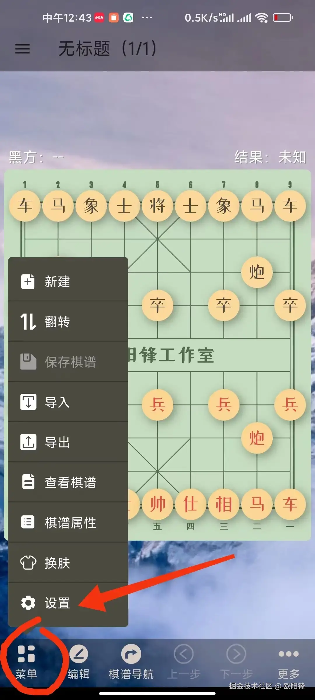
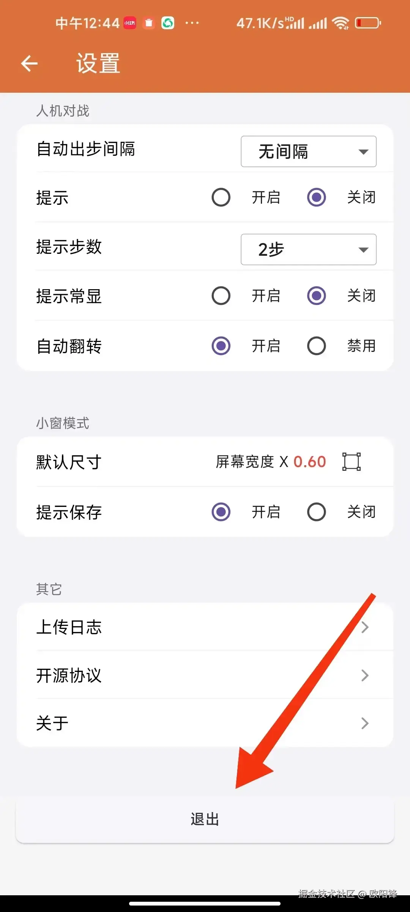
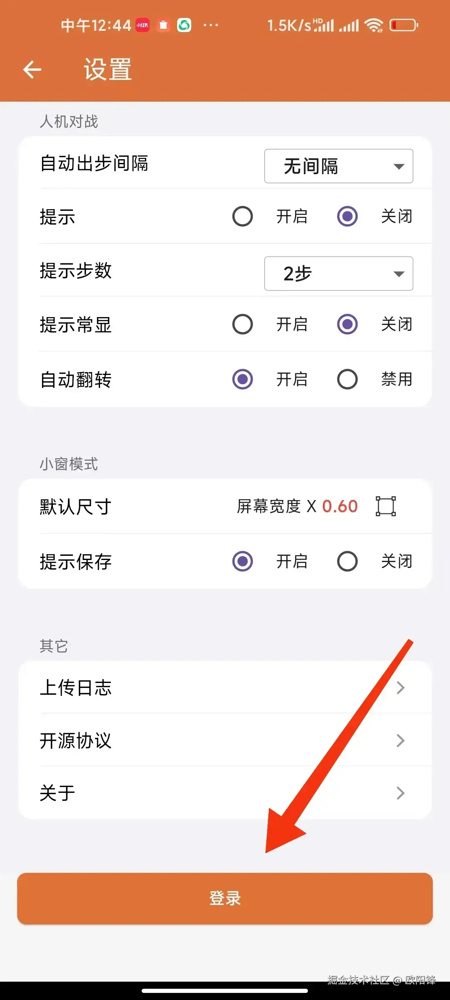
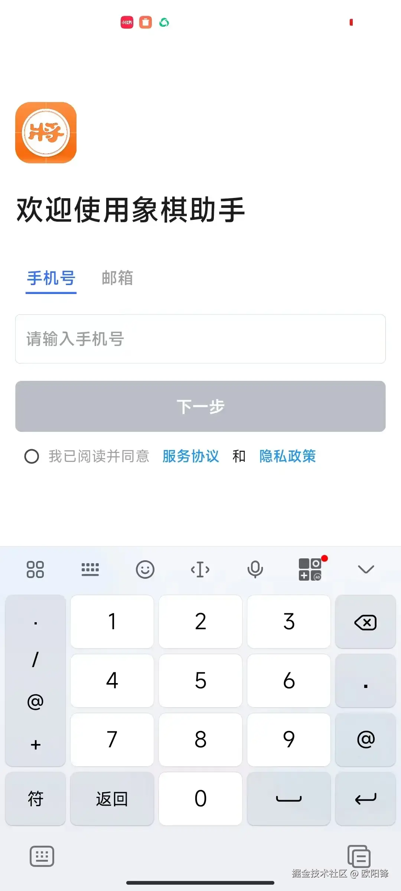
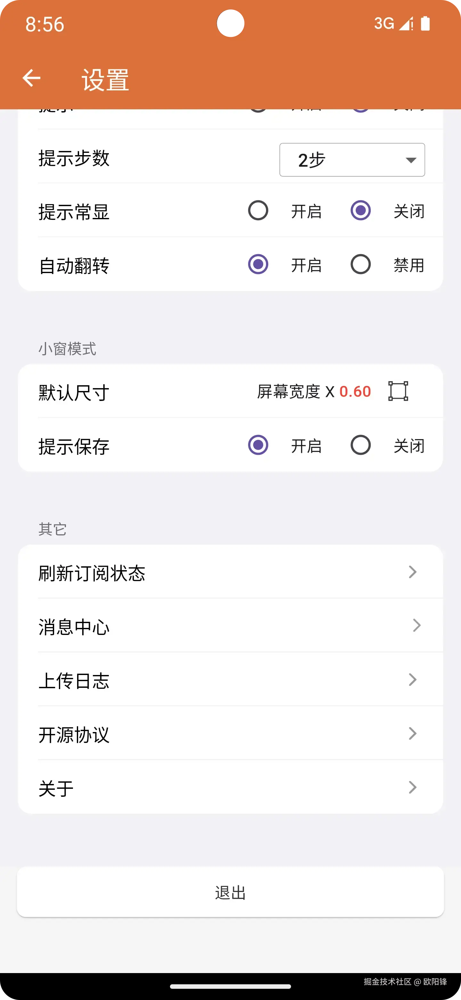
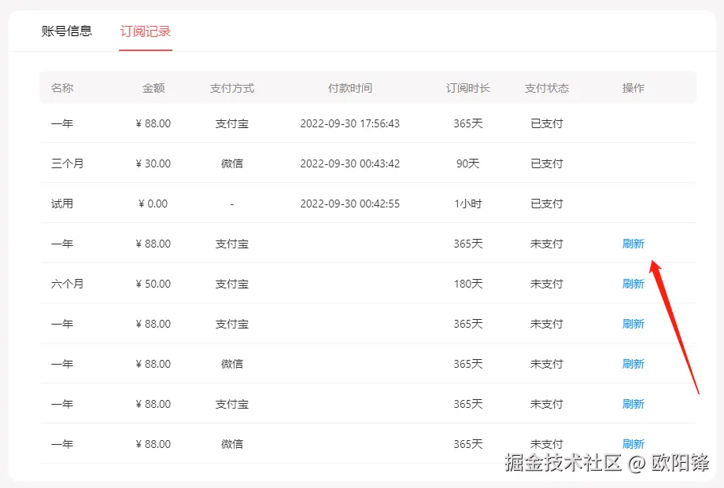
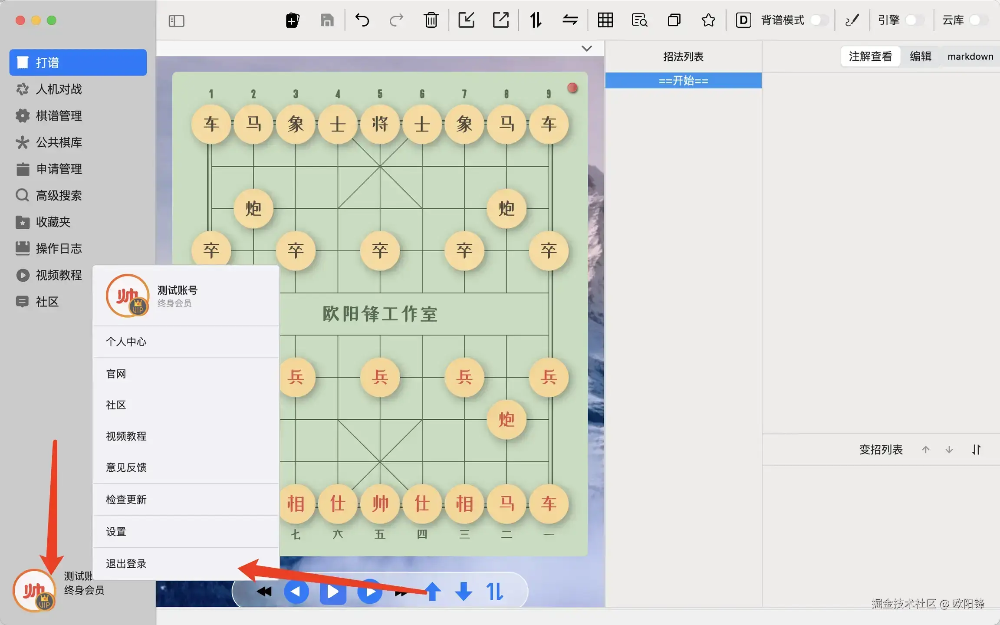
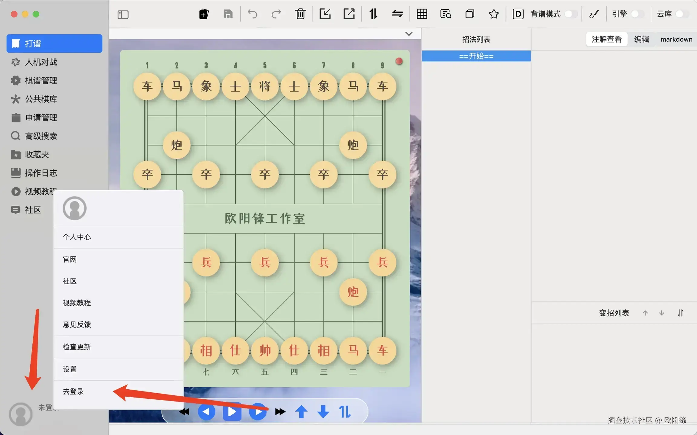
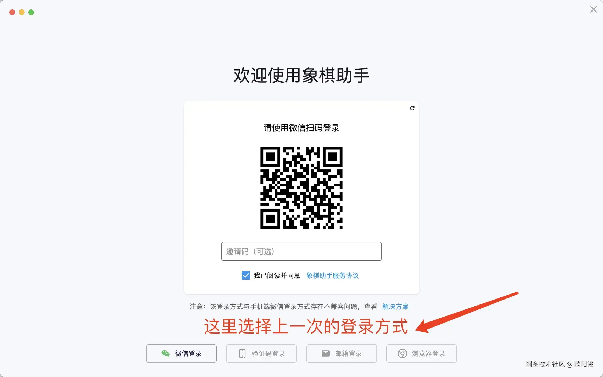

# 手机端

如果你在手机端付费成功后，订阅日期依然未发生变化，那可能是因为，你在订阅成功后，立即退出了付款页面，导致应用还未来得及刷新订阅状态，不用担心，大多数情况下，实际订阅状态已发生变更，你可以尝试通过如下方式处理。

**先退出登录，操作方法如下：**

在打谱页面，点击下方菜单，选择“设置”，打开设置页面：

​

**滑动到设置页面最下方，点击“退出”：**

​

**退出成功后，点击”登录“按钮，回到登录页面，使用同样的账号，重新登录即可：**

​

​

# 方法二

在最新版手机应用的设置页面，点击刷新订阅状态，刷新后通过会看到订阅时间的变化，通常可以解决你的问题。

​

**注：如果以上方案仍不能解决你的问题，请联系客服处理（客服微信：ouyangfeng_office)**

# **网页端**

如果遇到这种情况，可登录官网 <https://cca.yhdm360.cn>，登录后，切换到订用户中心 <https://cca.yhdm360.cn/userCenter>，选择订阅列表：

​

​如上图，选择最近的订单，点击刷新，可从微信或支付宝同步支付状态。同步完成后，订阅状态也会同步变更。

如果你使用桌面端（Windows、macOS、Linux）平台软件也遇到了订阅后，会员未到账问题，同样可以参考手机端的方式，先退出登录，再重新登录试试看。注意，不是关闭软件并重新打开。

桌面端退出登录的方式如图所示：

​

重新登录的方法如下：

​

​

**注：如果以上方案仍不能解决你的问题，请联系客服处理（客服微信：ouyangfeng_office)**

​