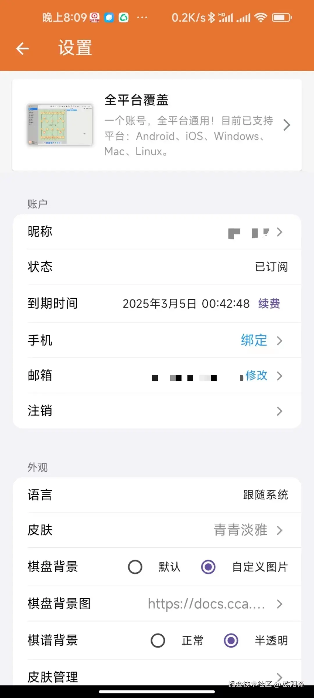
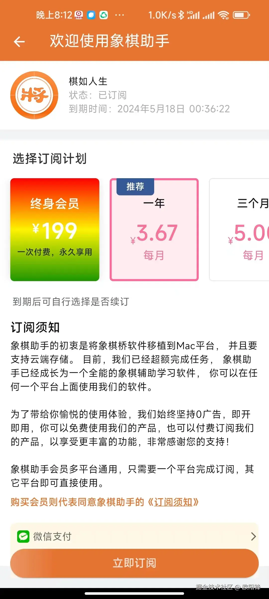
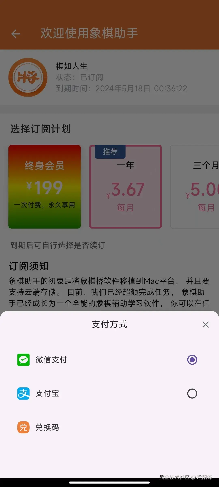
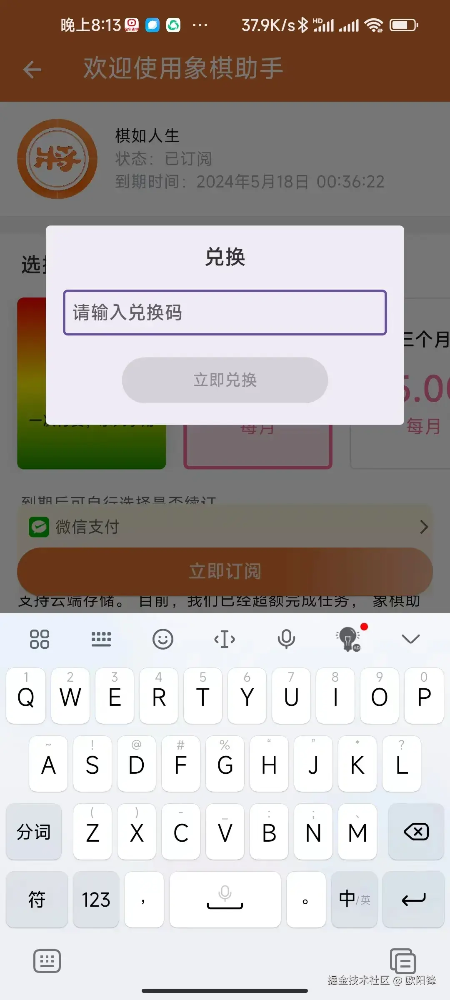
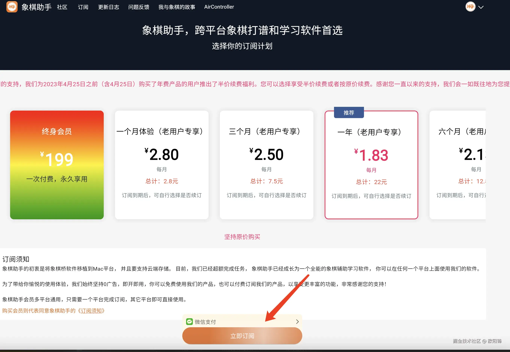
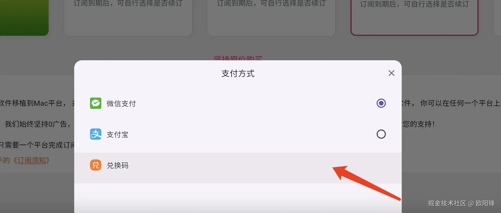
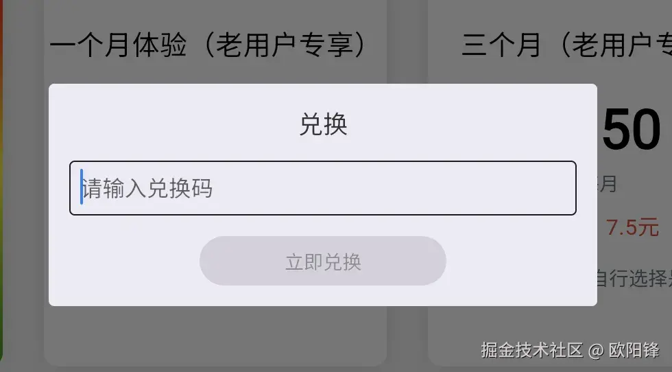

当然，完成发放后，可能部分棋友不知道如何激活，会向你咨询激活相关事宜。那么，接下来就给大家讲解，如何使用兑换码激活象棋助手会员产品。

这里要分两种情况，如果是Android手机，当然非常简单。

**首先，确保你的App版本已经更新到了0.5.0，如果没有，可前往小米市场、应用宝或者象棋助手官网下载安装最新版本。**

​

接下来，点击左侧Tab切换到设置页面，如果你还没有购买过象棋助手会员，到期时间右侧，会显示“订阅”，已经购买过，则显示续费。这里，我们点击续费，即可切换到订阅页面：

​

点击浅黄色条所在位置，即这里的微信支付，即可看到如下弹窗：

​

这个时候，点击兑换码，会出现一个弹窗，要求输入兑换码。此时，输入正确的兑换码，即可完成兑换：

​

 

通过以上几个步骤，即可完成通过兑换码购买象棋会员的操作。

 

以上是Android设备的操作流程，如果是iOS端或者电脑端软件，则稍微麻烦一点，我们需要通过官网完成兑换。

由于我们的账号是通用，因此，我们只需要打开象棋助手官网[https://cca.yhdm360.cn](https://cca.yhdm360.cn/)，点击右上角登录，登录同一个账号。登录后，点击首页上方菜单“订阅”，即可进入网页端的订阅页面：

​

打开后，同样点击浅黄色条所在位置，点击后，即可看到一个支付方式选择弹窗，我们选择兑换码：

​

​

接下来，同Android端一样，输入兑换码，即可完成兑换。完成兑换后，退出你的iOS app或者你的电脑端app，重新使用刚刚网页端登录的账号登录即可。

## 账号互通说明

注意，这里如果网页端是使用新版微信扫码登录的话，手机端默认的微信登录与网页端的微信登录是不一致的，手机端的微信登录等同于网页端的旧版微信登录，这里推荐在网页端绑定一个邮箱或者手机号。然后手机端使用手机号或者邮箱登录即可。

具体的原因，请参考文章：

​