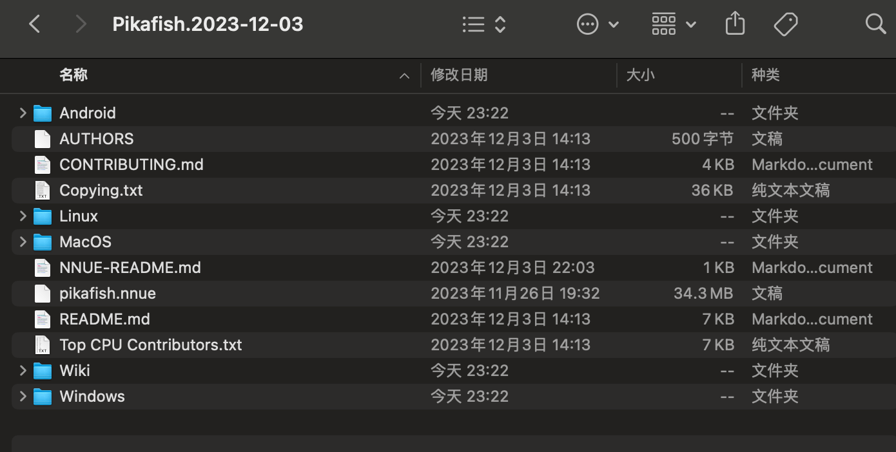
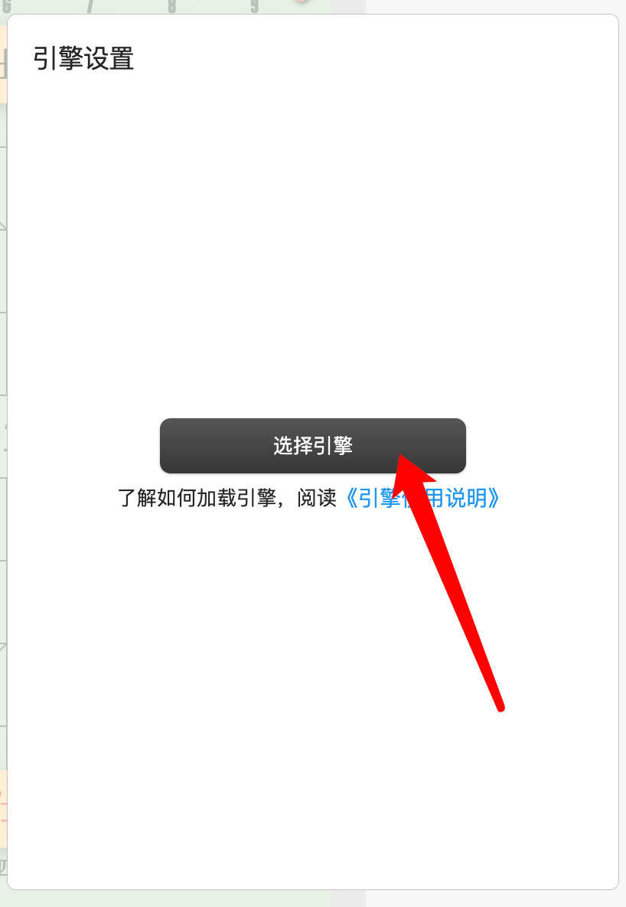
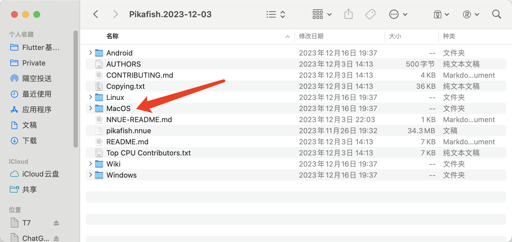
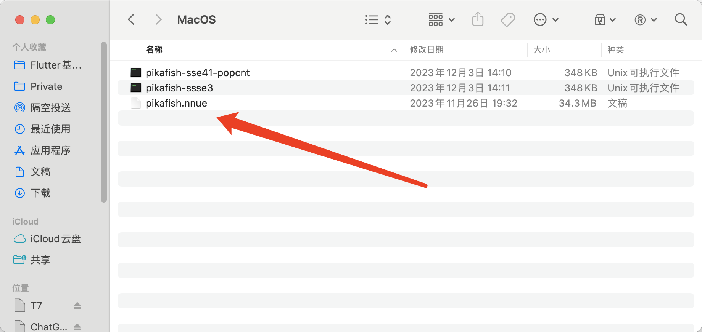
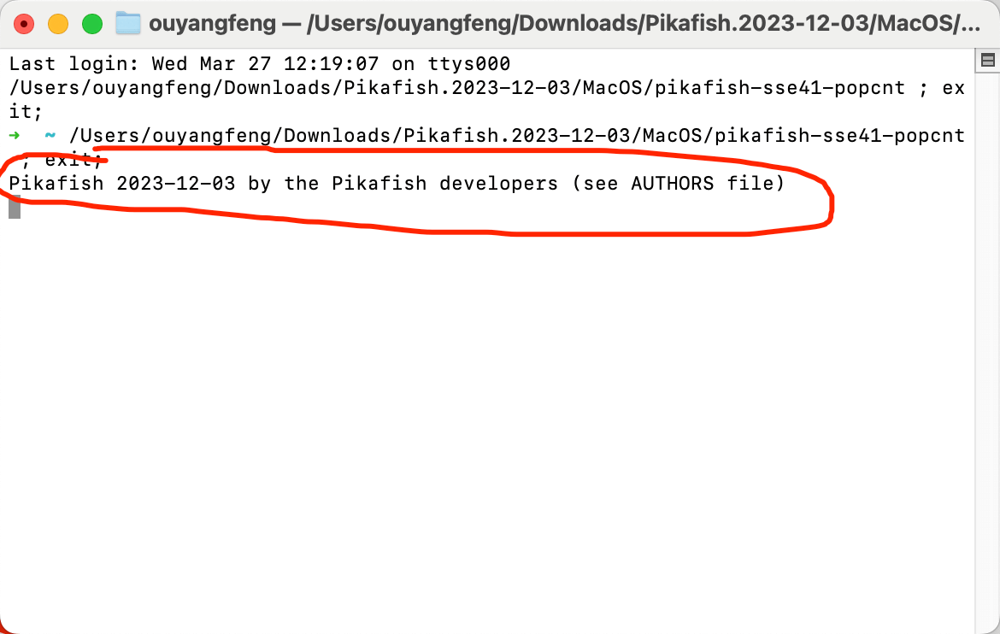
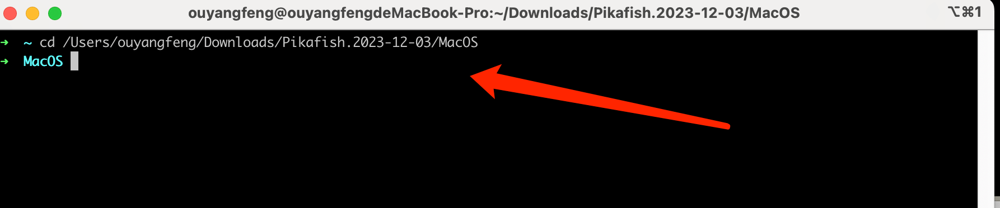
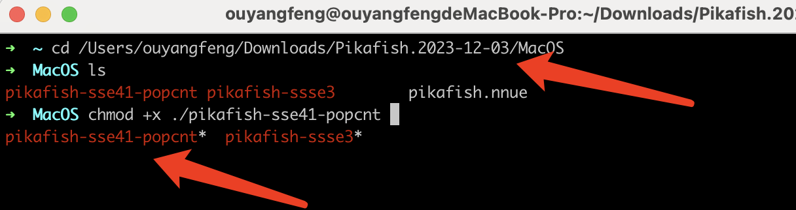
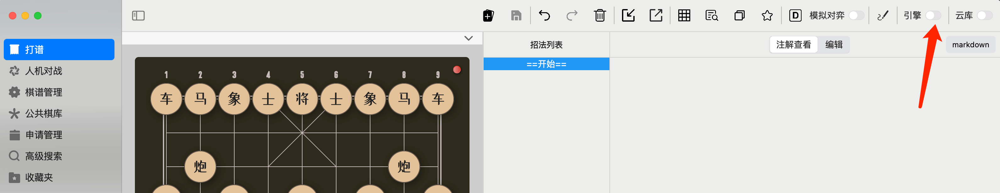
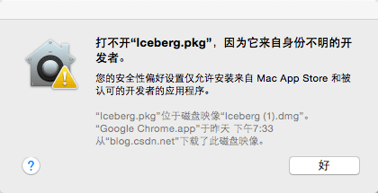

本文以0.8.7版本为例，讲解如何在象棋助手中导入第三方象棋引擎。

## 请注意：

-   引擎是来自第三方软件团队开发，并非象棋助手软件要求下载此类文件，这是两码事。
-   如果你花费了很多时间，还是无法搞定引擎加载，请放弃！因为，这对你来说可能是一件麻烦事，花再多时间都是徒劳。
-   如果你是Mac用户，那么，恭喜你，加载象棋引擎对你来说可能是件麻烦事，这是由于Mac系统的一些限制，导致应用调用第三方进程比较困难，相对于Windows与Linux，Mac系统均要复杂很多。
-   象棋助手并不是只支持皮卡鱼引擎，皮卡鱼引擎也并非象棋助手团队开发，我们只是以开源的皮卡鱼象棋引擎为例，来演示加载第三方象棋引擎。

接下来，我们就以开源的皮卡鱼象棋引擎为例来演示，如何使用象棋助手加载第三方象棋引擎。

## Windows平台

Windows平台是所有平台中最简单的！

在Windows平台加载皮卡鱼象棋引擎，共分为三步：

1.  下载皮卡鱼引擎
1.  移动nnue文件到windows同级目录中
1.  选择exe文件并加载

首先，第一步，前往皮卡鱼官网（<https://www.pikafish.com/>），选择最新的Release包，下载并解压，解压后，大概如下图所示：

第二步，打开象棋助手，在引擎设置页面，点击按钮“选择引擎”。这个时候，系统会要求你选择引擎入口文件，选择上图中任意一个exe文件即可。不同exe文件棋力不同，关于具体的棋力差距，请查看皮卡鱼社区了解，这不是象棋助手考虑的事情。

恭喜你，通过以上几个步骤，引擎加载就已经搞定了，是不是非常简单？

## 注意事项
* 将pikafish.nnue文件与引擎入口文件在同一个目录下面，最新版本已经在同一个目录下，大多数情况下不用关注这个问题
*  你的电脑不一定能使用所有的exe入口文件，可能存在不兼容，保险起见，请先选择`pikafish-sse3.exe`测试，如果不行再选择`pikafish-sse41-popcnt.ext`测试，直到可以正常运行为止

## macOS平台

Mac平台是所有平台中最麻烦的一个，这并非象棋助手有意为之，而是Mac系统的各种限制导致的，这或许是苹果为了保持系统的安全性不得已而为之吧。

为了防止你因为搞不定引擎加载而感到沮丧，这里我先把“丑话”说在前头。为了让你能够快速搞定引擎加载，你最好：

1.  **了解一些基础的unix命令行**
1.  **了解如何打开未知源应用**
1.  **学会放弃！如果你始终搞不定引擎加载，请放弃，或者向客服寻求帮助**

如果你已经了解了以上三点，那么，我们现在开始！

我们依然以皮卡鱼象棋引擎为例（请注意，象棋助手并不只支持皮卡鱼，但我们推荐开源的皮卡鱼象棋引擎！）

**第一步，如果你是通过App Store安装的版本，请先去官网<https://cca.yhdm360.cn>下载非沙盒版本**

*如果你使用的是离线版，请前往离线版官网[https://cca2.yhdm360.cn](https://cca2.yhdm360.cn])下载非沙盒版本*

**请注意：由于App Store的限制，在应用市场下载的版本并不支持导入第三方引擎，这依然是苹果的安全性策略限制所致，如果你想导入第三方引擎，请去官网下载非沙盒版本。**

**请注意：由于App Store的限制，在应用市场下载的版本并不支持导入第三方引擎，这依然是苹果的安全性策略限制所致，如果你想导入第三方引擎，请去官网下载非沙盒版本。**

**请注意：由于App Store的限制，在应用市场下载的版本并不支持导入第三方引擎，这依然是苹果的安全性策略限制所致，如果你想导入第三方引擎，请去官网下载非沙盒版本。**

**第二步，依然是先从源码库下载皮卡鱼引擎，具体请参考Windows部分进行下载。**

下载链接：<https://www.pikafish.com/>

**第三步，将pikafish.nnue文件移动到上图中的MacOS目录下。**

**第四步，先尝试双击打开MacOS目录中的除nnue外的任意一个文件，例如这里的pikafish-sse41-pocnt**

如果双击自动打开了一个终端，看到了如上图所示的引擎内容输出，则表示当前引擎已经被赋予了可执行权限，你可以直接转到步骤五。

而如果你双击并未打开终端，无法看到如上图所示的输出，则代表当前引擎并未被赋予可执行权限。接下来，我们进入第五步，为引擎赋予可执行权限。

**第五步、通过命令行为引擎入口文件添加可执行权限。**

这个步骤对很多棋友来说，可能是最难的一步，如果你感觉到困难，请选择放弃，推荐通过云库使用我们的象棋助手，或者加入我们的QQ交流群（725840654），寻求帮助。

这里需要用到一个命令chmod +x，这个命令的意思是给文件添加可执行权限，如果你还不了解这个命令怎么用，请百度稍微了解一下，以便可以顺利解决命令执行过程中可能遇到的一些问题。

这里，我们继续，首先打开终端，通过cd命令进入MacOS目录，如果你对cd命令也不了解，推荐百度了解一下，这是unix命令行中最简单的一个命令。

进入MacOS目录后，为你想要选择作为入口文件的脚本文件添加可执行权限，如下图所示：

这里我选择**pikafish-sse-41-pocnt**作为引擎入口文件，你也可以选择其它文件作为入口文件，例如pikafish-sse3，版本不同还可能有其它入口文件，不同文件算力有所差别，关于这些文件的具体差别，请以皮卡鱼官方文档为准。再次提醒：象棋助手是一个界面软件，我们并不绑定任何引擎，关于你正在使用的任何引擎，遇到的任何关于引擎相关的细节问题，请咨询相关的引擎客服，或者官方文档。当然，你也可以在我们的QQ交流群提问，了解的一些棋友可能会给你解答。

接下来，我们进入第五步！

**第六步、选择刚刚赋予可执行权限的引擎入口文件**

点击如上图所示位置，首次打开引擎会提示选择引擎文件，选择我们刚刚赋予可执行权限的引擎入口文件即可。

大部分情况下，到这里基本就OK了，但还是有用户可能会遇到如下图所示问题。

由于我的电脑上没有出现这个问题，这里我随便找了一张图片用于举例，遇到这个问题可参考文档<https://blog.csdn.net/a15835774652/article/details/131107047>，或者百度搜索”Mac提示来自身份不明的开发者“问题。

通过以上几个步骤，Mac端的引擎导入也搞定了，如果你还有其它问题，请添加QQ交流群或者客服微信进行咨询。

## 注意事项
* 由于Mac电脑有两种类型的CPU，早期版本使用的是Intel的CPU，而最近几年的版本都是M系列芯片，两者需要使用的入口文件不一致。最新版本的皮卡鱼官方已经放弃了Intel版本的皮卡鱼文件的编译，如果你是Intel系列的CPU，可以前往前往皮卡鱼源码库<https://github.com/official-pikafish/Pikafish/releases>下载2023年以前的版本（这个网站如果打不开，请添加QQ交流群725840654求助）
* 上面的截图来自皮卡鱼的老版本，最新版本的M系列芯片的入口文件已经变成了一个唯一的文件`pikafish-apple-silicon`，请随机应变，不用被文中截图误导
* 以上操作对于非技术人员来说，可能有些困难，如果遇到问题，请添加QQ交流群725840654，我们大概可以在2分钟以内帮助你搞定。

# Linux平台

Linux平台与macOS平台使用方法基本一致，但比macOS平台使用要更简单，不用担心严格的安全性检测问题，这里就不在赘述了，如果你还是无法搞定，请添加QQ交流群或客服微信进行咨询。

 

# 附录

QQ交流群：725840654

客服微信：ouyangfeng_office

视频教程1：[Windows、Linux平台导入象棋引擎](https://www.bilibili.com/video/BV17H4y1k7Ko/?vd_source=7b89b7819b83ea99c40e7d2d7342d50d)

视频教程2：[苹果电脑导入象棋引擎](https://www.bilibili.com/video/BV1za4y1R7kK/?spm_id_from=333.788&vd_source=7b89b7819b83ea99c40e7d2d7342d50d)

​