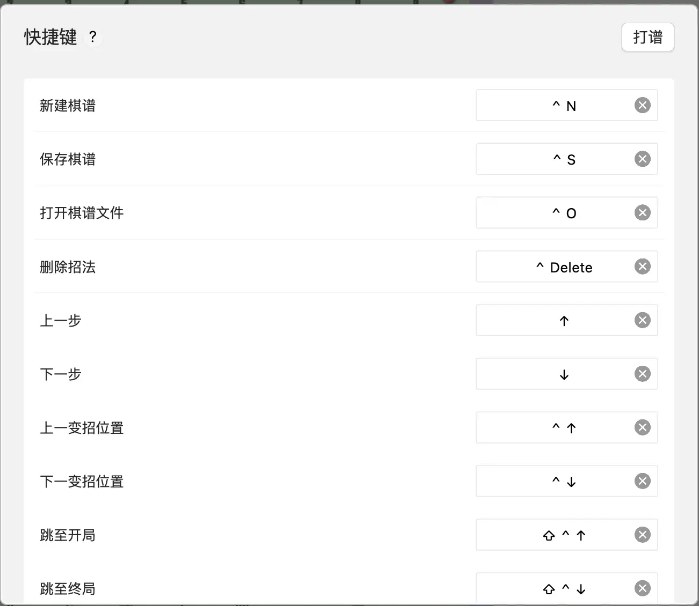
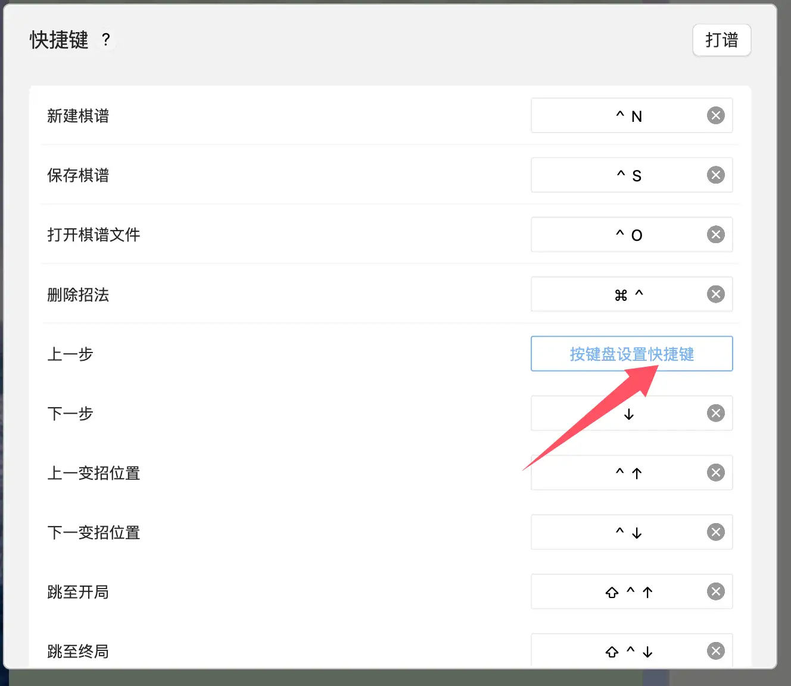
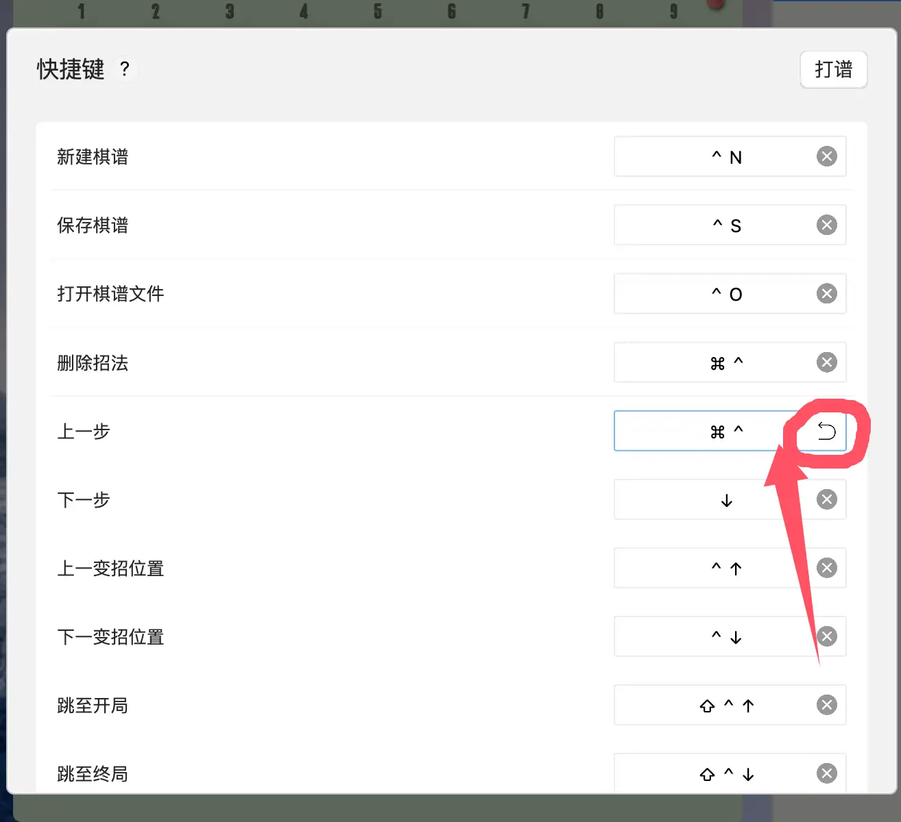
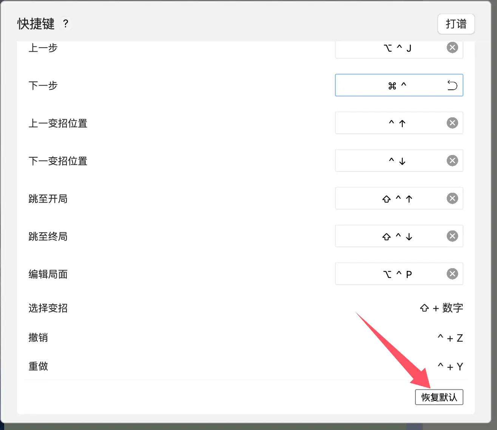

本文以桌面版0.9.2版本为例，说明快捷键的使用方法。

# 如何查看快捷键

目前，我们设置了两个入口。你可以通过以下两个入口查看默认快捷键。

**第一个入口：菜单 -> 文件 -> 快捷键**

**第二个入口：点击头像，右键菜单，打开设置，找到快捷键，修改快捷键**

截止0.9.2版本为止，目前所有可用的快捷键，默认情况下，参考以下表格：

|        |                    |
| ------ | ------------------ |
| 功能     | 快捷键                |
| 新建棋谱   | Ctrl + N           |
| 保存棋谱   | Ctrl + S           |
| 打开棋谱文件 | Ctrl + O           |
| 删除招法   | Ctrl + Delete      |
| 上一步    | 上箭头                |
| 下一步    | 下箭头                |
| 上一变招位置 | Ctrl + 上箭头         |
| 下一变招位置 | Ctrl + 下箭头         |
| 选择变招   | Alt + 数字           |
| 跳至开局   | Ctrl + Shift + 上箭头 |
| 跳至终局   | Ctrl + Shift + 下箭头 |
| 编辑局面   | Ctrl + Alt + P     |
| 撤销     | Ctrl + Z           |
| 重做     | Ctrl + Y           |

# 如何修改快捷键

除了使用默认快捷键之外，你还可以自定义快捷键，具体操作方法如下，先打开快捷键弹窗，选中你想修改的快捷键：

你将看到，选中位置变成了“按键盘设置快捷键”。接下来，在键盘上按下，你想要设置的快捷键：

按下按键后，你将看到输入框内显示你按下的键，输入框右侧有个还原的图标，点击该图标可以还原到之前设置的快捷键。

接下来，你只需要点击其它输入框，即可让刚刚设置的快捷键生效。

注意：如果快捷键与之前设置的快捷键冲突，将提示快捷键冲突，设置失效。

# 如何恢复默认快捷键

恢复默认快捷键非常简单，如果你修改了快捷键，在快捷键弹窗的最下方的“恢复默认”按钮会被激活，点击“恢复默认”即可恢复到默认快捷键。

# 快捷键偶尔失效怎么办？

如果遇到快捷键失效的问题，可以先切换到其它页面，再切换回来，例如：先切换到人机对战，再切换回来，通过就可以继续使用！

# 注意事项

1）我们无法检测当前快捷键是否与其它软件设置的快捷键冲突，如果发生冲突，请自行通过以上方式修改快捷键。

2）快捷键设置必须添加至少一个修饰键（Ctrl、Shift、Alt、Meta等）

3）如果没有遇到任何问题，不建议修改快捷键，直接使用默认就好

​