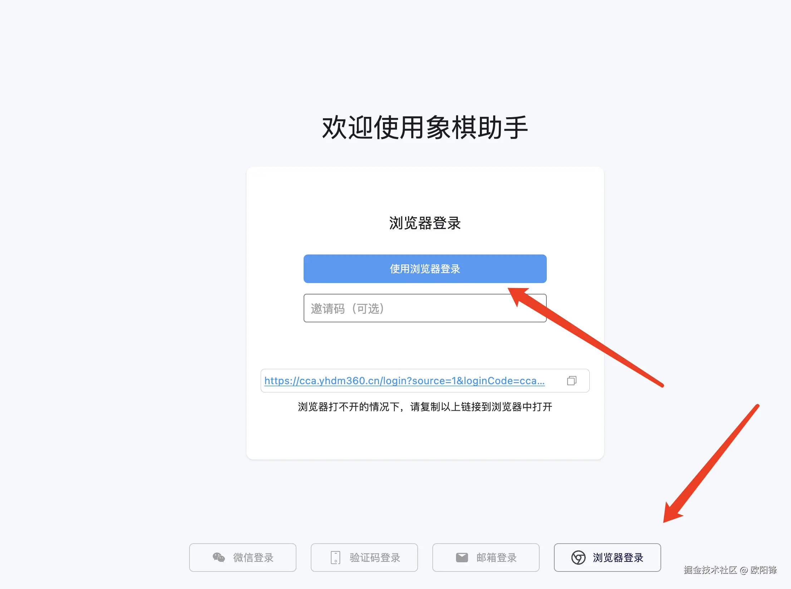
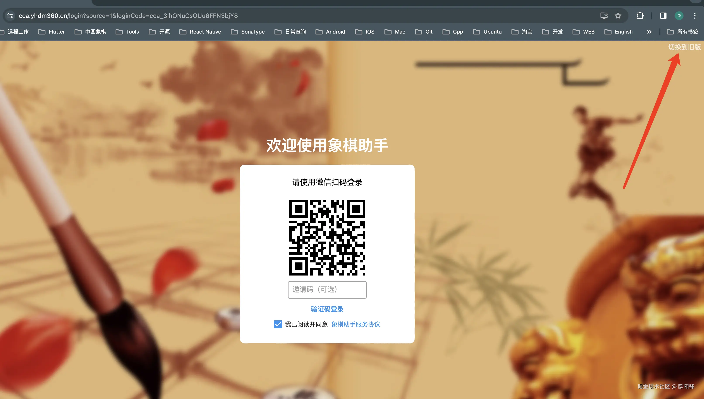
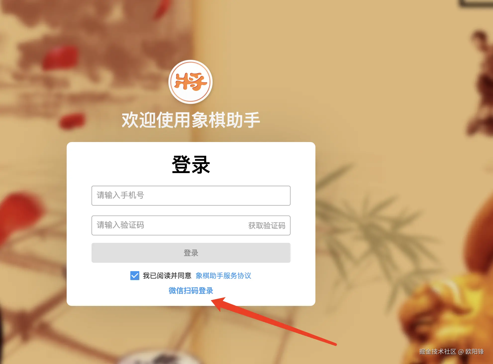

​

###  问题一、手机端使用微信登录，付费后。电脑端同样使用微信登录，却显示未付费

问题原因：由于电脑端更换了一次微信登录方式，导致电脑端的微信登录账户与手机端并不通用。为了可以保持通用，推荐通过以下几种方式处理：

**方法一：电脑端选择网页登录，并切换到旧版登录方式，操作方式参考下图：**

​

​

​

​

通过以上方式登录，即可同步手机端微信登录账户。

 

**请注意：为了实现与手机端微信登录同步，电脑网页端一定要切换到旧版微信登录！！！**

**请注意：为了实现与手机端微信登录同步，电脑网页端一定要切换到旧版微信登录！！！**

**请注意：为了实现与手机端微信登录同步，电脑网页端一定要切换到旧版微信登录！！！**

### **方法二：绑定同样的手机号或者邮箱，使用手机号或者邮箱登录保持同步**

由于方法一的操作较为复杂，这里推荐方法二，在手机端的设置页面，或者电脑端的用户中心，绑定你的常用手机号或者常用邮箱，两者均使用手机号或者邮箱登录即可保持同步。方法二操作较为简单，这里不再赘述了，有问题请添加QQ交流群咨询！

**问题二、电脑端微信扫码登录，付费后。手机端同样使用微信登录，却显示未付费**

这是与上述问题同样的原因，解决方案，推荐方法二，在电脑端微信登录后，在电脑端的用户中心绑定你的手机号或者邮箱，在手机端使用邮箱登录即可。

**QQ交流群：725840654**

​