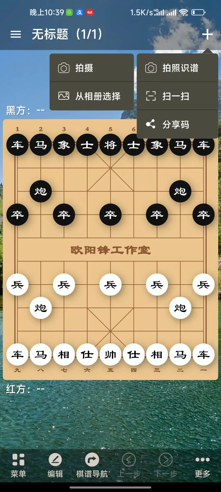
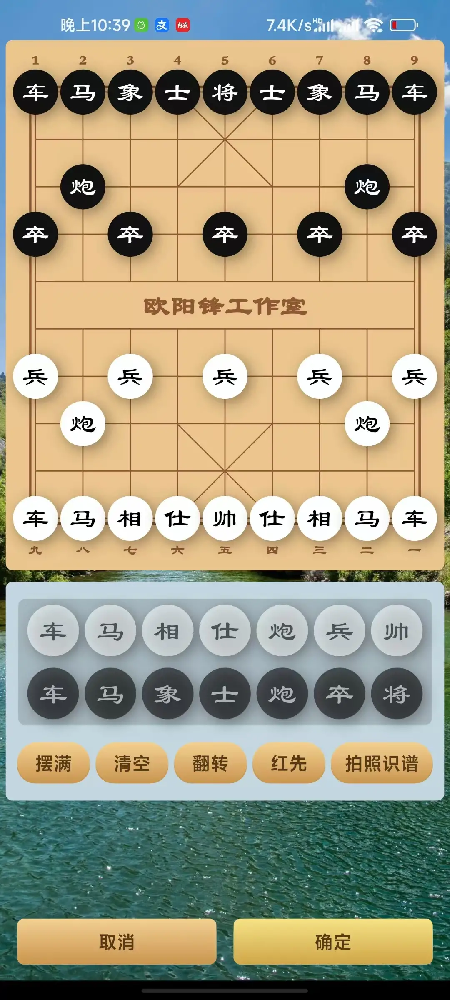
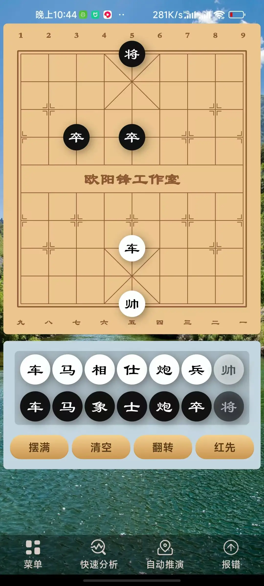

拍照识谱是一项通过大模型识别象棋局面图片并将局面还原到象棋助手的功能。

## 入口

目前，你可以通过以下两个入口打开拍照识谱功能：

1、点击打谱右侧加号按钮，再选择拍照识谱。然后选择拍照或者选择图片进行识别

2、在编辑局面页面选择拍照识谱

​

## 错误上报

由于大模型具有一定的不确定性，识别遇到错误是完全正常的。你可以点击“报错”按钮提交给我们，我们会不断优化模型识别，以达到更好的识别效果。注意：该优化过程无需更新手机版本。

​
​