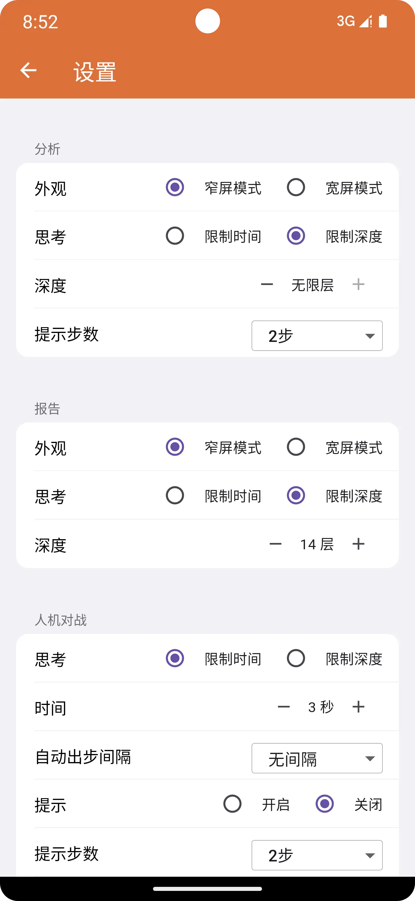

棋谱分析是一个智能复盘功能，使用皮卡鱼引擎提供算力支持。棋谱分析需要一定的时间，时间取决于你手机的性能。

## 局势图

当棋谱分析完成，你可以滑动快速找到本局局势的转折点，定位哪一步下错了。曲线在0上方代表红方占优，曲线在0下方代表黑方占优。

## 分析

分析模块包含实时局势图、引擎输出、云库输出三个模块，实时局势图仅在移动棋子后才会形成曲线图，形成曲线图后，你可以滑动到任意一个棋局位置。

移动棋子后，引擎会实时输出推荐招法，同时会在棋盘显示推荐招法箭头指示。与此同时，云库也会实时输出推荐招法，点击推荐招法可以切换到选中招法。

## 报告

根据实战和引擎推荐着法局势分的对比，对每一步着法进行打分，并按照开局、中局、残局的划分给出相应分数。

开局: 局面开始的前10回合。

残局: 设车的价值900，马和炮的价值450，双方大子的价值总和都<1500，例如:双炮马对双马炮 (450+450+450=1350<1500)

中局: 开局和残局之外的局面。

失误: 局势图跳水50分以内，评价为“优”，跳水100分以内，评价为“良”，跳水150分以内，评价为“中”，跳水200分以内，评价为“差”，跳水200分以上(丢一个已过河兵)，评价为“错”，即失误，点击可查看相应局面。

## 开局库

开局库最早由兵河五四软件提出的开局着法数据库，它有点类似于云库。只不过云库存储在云端，而开局库存储在本地而已。

目前，比较主流的开局库格式有obk、xqb等，当然还有其它一些软件自己定义的格式。目前，大部分主流格式象棋助手都有很好的支持，你可以自行尝试。

关于开局库的具体用法，请参考 [开局库使用方法](https://static.cca.yhdm360.cn/faq/obk)

## 配置

在设置页面的“报告/分析”区域可以修改引擎思考方式，分别是：限制时间与限制深度，限制时间，即在指定时间内搜索最佳招法。限制深度，即在指定层级搜索最佳招法。

请注意：由于报告需要逐一分析每一步招法优劣，每一步分析时间过长或者层级过高可能造成报告生成时间过长。

