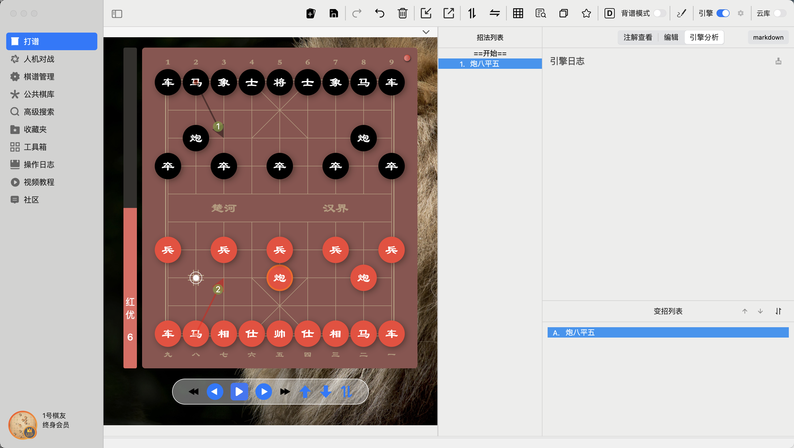
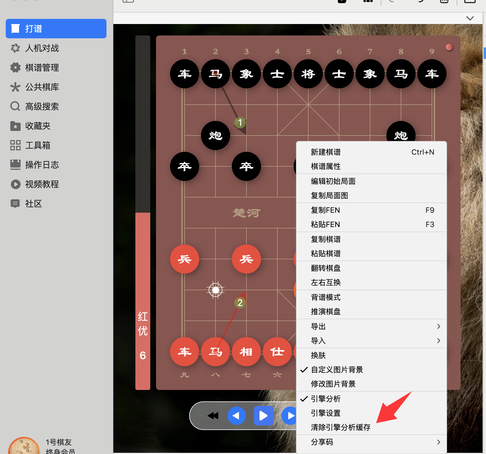
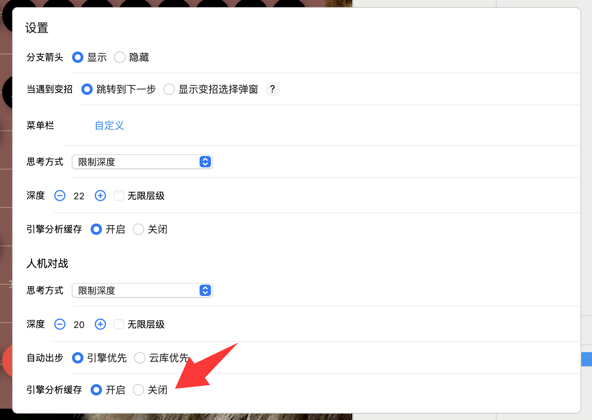

> 在一些情况下，你可能会看到下面的景象，在棋盘左侧有有引擎打分，并且也有箭头指示，但右侧的引擎分析日志却一片空白...

### 起因
由于之前有棋友反馈，引擎在分析局面的时候CPU占用几乎会达到100%，在快速切换局面的情况下，电脑很容易出现过热，风扇狂转卡死的情况。为了最大程度上避免这种情况，在后续的新版本中，我们加入了引擎分析缓存。
默认情况下，已经分析过的局面，不再进行重复分析。这在很大程度上，可以避免一些电脑在快速切换局面的情况下出现卡死的问题。

### 如何继续分析重复局面呢？
在引擎分析缓存开启的情况下，如果你希望继续分析重复局面，你可以在打谱棋盘界面，鼠标右键选择“清除引擎分析缓存”。清除引擎分析缓存后，再次切换到已经分析过的局面，就可以看到引擎分析日志了。

### 关闭引擎分析缓存
如果你的电脑性能还不错，并不担心过热问题，你可以在设置页面关闭引擎分析缓存，并且清空引擎分析缓存。后续即使是重复局面，也会重复分析，你将一直可以看到引擎分析日志输出。

