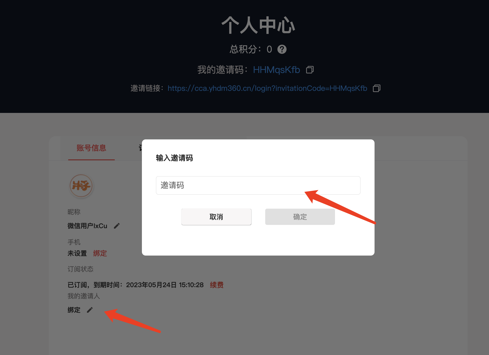
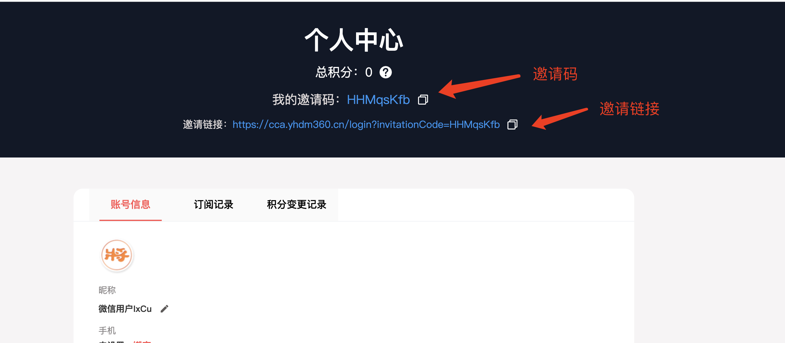

积分是象棋助手0.3.5版本以后推出的新功能，积分可用于抵扣购买金额，后续可能提供直接提现到微信功能。

## 如何获取积分？

目前，获取积分的唯一方式是，通过绑定邀请人，后续邀请人只要订阅了象棋助手，邀请人即可获得付费金额的10%作为奖励积分，以下是具体操作方法：

### 第一步：登录象棋助手

你可以在网页端登录，或使用客户端登录，以下以网页端为例。

### 第二步：进入个人中心，在“邀请人”下方点击“钢笔”图标，输入邀请码绑定邀请人

​

通过以上两个步骤，即可完成邀请人的绑定，后续只要当前用户付费订阅，绑定的邀请人即可获得10%的积分奖励。

## 如何查看邀请码？

打开个人中心，即可看到自己的邀请码，点击右侧“复制”图标即可复制自己的邀请码，发送给你邀请的用户，即可完成邀请码的绑定。

​

## 如何查看自己的当前积分？

在上图中，个人中心页面会显示当前自己的总积分，切换到”积分变更记录“Tab可查看积分的所有交易记录。

## 邀请链接怎么用？

邀请链接是一种快捷的绑定邀请人的方法，你可以在社交平台分享你的邀请链接，只要有用户通过当前链接登录，即可完成邀请人的绑定，后续每次用户付费，你都可以获得10%的邀请积分奖励。

## 积分与金额比例是多少？

目前，100积分等于一元人民币，积分抵扣购买金额也会按照这个比例进行。

​