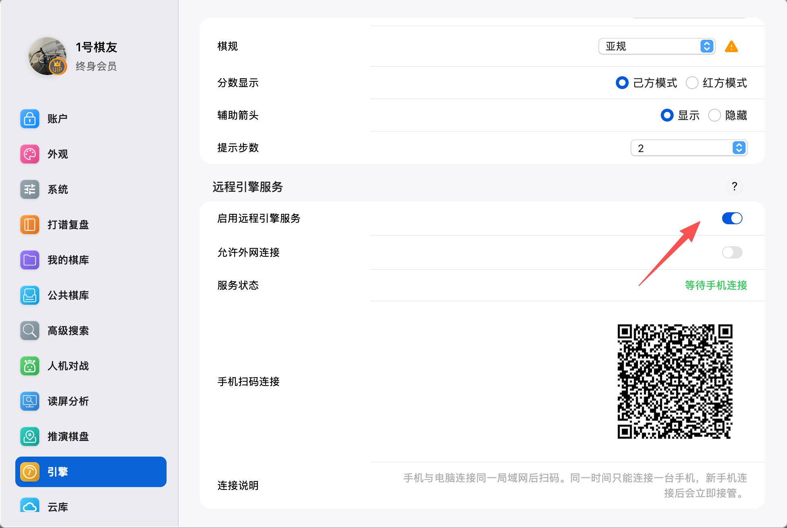
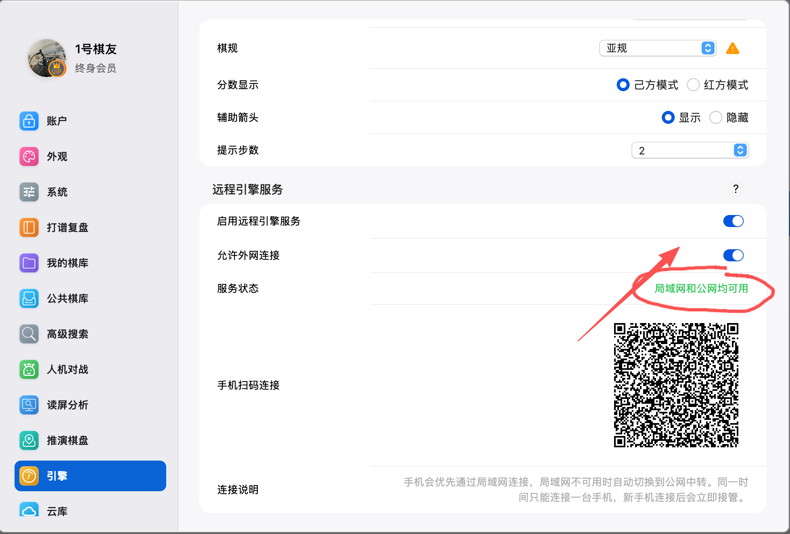
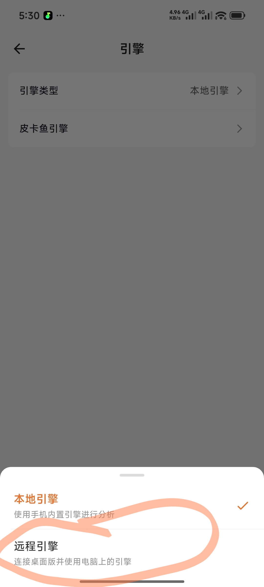
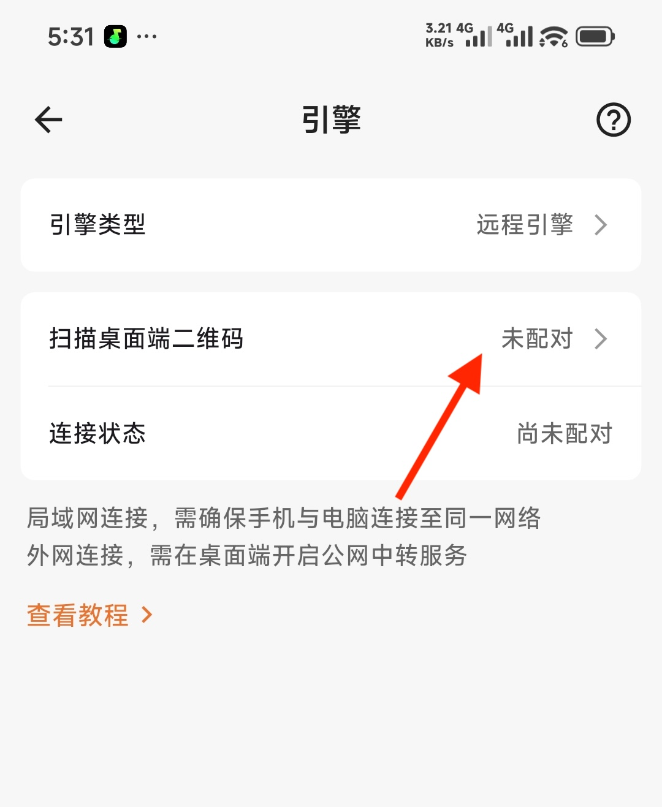
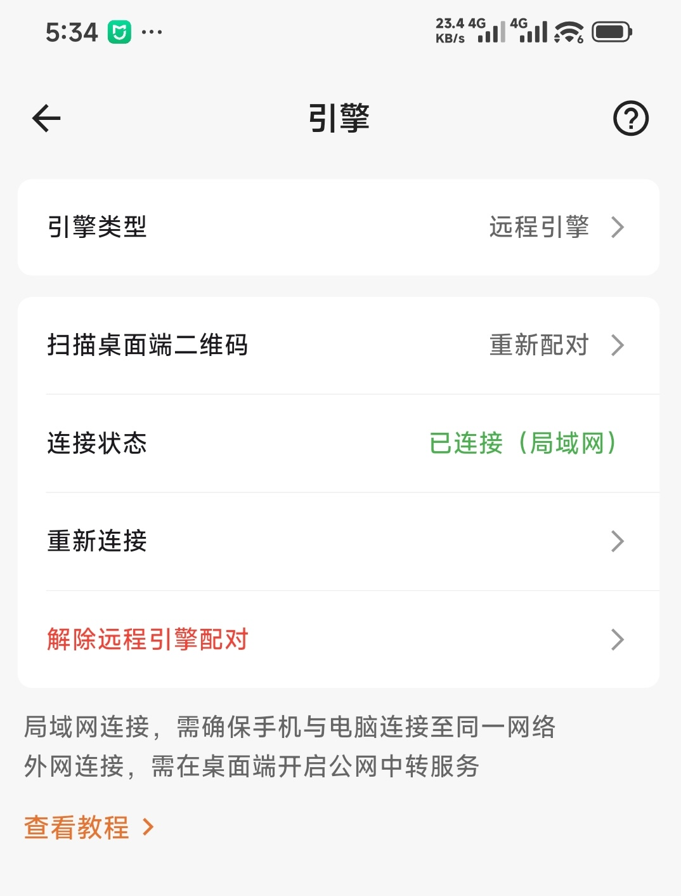

# 远程引擎使用指南

远程引擎是把象棋助手桌面版作为远程引擎服务提供给手机版使用，手机完成配对后，在分析棋局时可以利用电脑的性能，无需在手机上运行同等强度的引擎，可以极大地减少手机发热情况！

远程引擎支持局域网直连和公网中转两种连接方式：

| 连接方式  | 适用场景                | 使用条件                           |
| ----- | ------------------- | ------------------------------ |
| 局域网直连 | 手机和电脑需要连接至同一网络      | 开启桌面端远程引擎服务后扫码即可，不要求两端登录同一个账号  |
| 公网中转  | 不要求连接同一网络，任何网络都可以连接 | 桌面端开启“允许外网连接”，手机版和电脑版必须登录同一个账号 |

手机会优先尝试局域网直连；开启允许外网连接的情况下，如果局域网不可用，手机会自动尝试公网中转。

## 使用前准备

1. 将电脑版和手机版象棋助手升级到支持远程引擎的版本（`手机版 v1.2.3+`，`电脑版 v1.3.1+`)。
2. 确认电脑版已经正确加载引擎，并且可以正常分析棋局。
3. 使用期间保持电脑版象棋助手运行，并避免电脑休眠、断网或关机。
4. 准备使用局域网直连时，让手机和电脑连接同一个局域网。
5. 准备使用公网中转时，让手机版和电脑版登录同一个账号。

**桌面版下载链接：[https://cca.yhdm360.cn](https://cca.yhdm360.cn)，没有安装的用户可以点击链接前去安装！**

## 一、在电脑上开启远程引擎服务

1. 打开电脑版象棋助手，进入“设置 → 引擎”。
2. 找到“远程引擎服务”，开启“启用远程引擎服务”。
3. 等待服务状态显示“等待手机连接”，页面中会出现用于配对的二维码。

​

如果只在同一局域网内使用，到这里就已经准备完成。

如果需要在外网使用，请继续开启“允许外网连接”，并等待服务状态显示“局域网和公网均可用”。只有出现这个状态后，当前二维码才包含可供手机使用的公网连接信息。

​

> 请勿把远程引擎二维码截图发送给其他人。二维码中包含短期配对凭证，虽然凭证会过期，仍建议只让自己的手机扫描。

## 二、在手机上扫码配对

1. 打开手机版象棋助手，进入“设置 → 引擎”。
2. 将“引擎类型”切换为“远程引擎”。
3. 点击“扫描桌面端二维码”，使用象棋助手内的扫码页面扫描电脑上显示的二维码。
4. 等待连接完成，并检查“连接状态”：
   - “已连接（局域网）”表示手机正在直接连接电脑；
   - “已连接（公网中转）”表示手机正在通过服务器中转连接电脑。
5. 返回棋局或分析页面，即可使用电脑上的引擎进行分析。

仅仅选择“远程引擎”并不会完成配对。如果没有扫码成功便离开设置页面，应用不会保存一个无法使用的远程引擎状态，之后仍会使用本地皮卡鱼引擎。

## 三、局域网与公网如何切换

开启公网中转并成功扫码后，手机仍会优先使用速度更快的局域网直连。当局域网不可用时，手机会自动尝试公网中转，不需要手动切换。

需要特别注意：**公网连接能力以扫码时电脑生成的二维码为准。**

- 扫码时电脑已经显示“局域网和公网均可用”：手机以后可以在局域网和公网之间自动切换。
- 扫码时电脑没有开启公网中转：本次配对只包含局域网连接信息。即使电脑后来开启公网中转，手机也无法自动获得新的连接信息，需要重新扫码。
- 电脑关闭后重新开启公网中转，或者公网会话发生变化时，也建议刷新二维码并在手机上重新配对。

简单来说，如果要使用公网中转，请先在电脑上开启公网连接并等待状态正常，再让手机扫码。

## 四、重新连接与解除配对

手机端的远程引擎设置页面提供以下操作：

- “重新连接”：使用当前已经保存的配对信息再次连接。
- “重新配对”：扫描电脑上的新二维码，替换原来的配对信息。
- “解除远程引擎配对”：删除当前配对，并恢复使用手机本地引擎。

如果二维码提示过期，请在电脑端点击“刷新二维码”，然后重新扫描。

## 常见问题

### 1. 公网中转必须登录同一个账号吗？

必须。公网中转要求手机版和电脑版必须登录同一个账号！

### 2. 已经开启公网中转，为什么手机仍显示“已连接（局域网）”？

这是正常现象。手机和电脑处于同一局域网时，会优先选择局域网直连，因为路径更短、延迟通常也更低。只有局域网不可用时，手机才会尝试公网中转。

### 3. 手机关闭 Wi-Fi 后为什么无法切换到公网？

先确认扫码时电脑是否已经开启“允许外网连接”，并且状态已经显示“局域网和公网均可用”。

如果扫码完成后才开启公网中转，手机保存的旧配对中没有公网连接信息。请在电脑端刷新二维码，然后在手机端点击“重新配对”并再次扫码。

同时请确认手机和电脑登录的是同一个账号，且两端均能正常访问网络。

### 4. 为什么选择远程引擎后没有自动打开扫码页面？

这是正常的交互设计。选择“远程引擎”后，页面会显示扫码入口，由用户决定何时扫码。只有连接成功后，应用才会正式保存远程引擎设置。

### 5. 远程引擎断开后，分析会不会完全不可用？

不会。连接在分析过程中中断时，手机版会提示远程引擎已经断开，并让本次分析自动切换到手机本地引擎。远程连接恢复后，从下一次分析开始继续使用远程引擎。

手机本地引擎接管后，分析速度和手机耗电会受到手机性能影响。

### 6. 电脑关闭、断网或应用崩溃后会怎样？

重新打开电脑版象棋助手并恢复服务后，手机通常会尝试自动重连。如果页面明确提示会话已经结束或失效，请重新扫码配对。

### 7. 可以让多台手机同时使用同一台电脑的引擎吗？

不可以。一个桌面引擎同一时间只提供给一台手机使用。

如果手机 A 正在使用，手机 B 又完成连接，手机 B 会立即接管引擎，手机 A 正在进行的分析会停止并断开。手机 A 如果需要再次使用，应重新扫码连接。

### 8. 电脑和手机可以同时使用这个引擎分析吗？

不建议。远程引擎服务共享的是电脑版当前使用的引擎，而引擎不能同时处理两份独立分析任务。手机使用远程引擎时，请不要同时在电脑上启动另一项引擎分析。

### 9. 桌面端显示的“已连接”后面是什么？

新版会优先显示当前连接的手机名称，方便确认是哪一台手机正在使用引擎。旧版手机没有提供设备名称时，桌面端可能显示一个缩略的连接标识。

### 10. 为什么二维码无法识别或提示已经过期？

配对二维码中的凭证有有效期，而且会定期更新。请在电脑端点击“刷新二维码”，保持二维码完整显示，再使用象棋助手手机版重新扫描。

不要使用聊天软件压缩后的二维码截图，也不要扫描很久以前保存的截图。

### 11. 局域网连接失败怎么办？

如果电脑使用 Windows，最常见的原因是 Windows 阻止了手机连接象棋助手。可以先按下面的方法处理：

1. 第一次开启远程引擎服务时，Windows 可能弹出“是否允许此应用通过网络通信”之类的提示。请勾选“专用网络”，然后点击“允许访问”。
2. 如果之前点过“取消”，请在电脑上打开“开始”菜单，搜索并打开“Windows 安全中心”，依次进入“防火墙和网络保护 → 允许应用通过防火墙”。点击“更改设置”，找到“象棋助手”，并勾选它后面的“专用”选项。
3. 如果没有看到“象棋助手”，可以点击“允许其他应用”手动添加。普通安装版可以右键点击桌面上的象棋助手图标，选择“打开文件所在的位置”，然后选择其中的 `chinese_chess_assistant.exe`。
4. 确认电脑当前连接的是自己信任的家庭或办公网络。在 Windows 的“设置 → 网络和 Internet”中打开当前连接的 Wi-Fi 或有线网络，将“网络配置文件类型”设为“专用网络”。公共场所的 Wi-Fi 不建议这样设置。

不需要查找或手动填写远程引擎的端口号，允许“象棋助手”通过专用网络即可。也不建议为了使用远程引擎而完全关闭 Windows 防火墙。

完成以上设置后，请关闭再重新开启电脑端的“启用远程引擎服务”，刷新二维码，然后使用手机重新配对。

如果仍然无法连接，再依次检查：

1. 手机和电脑是否连接同一个路由器或局域网。
2. 路由器是否开启了访客网络、AP 隔离或客户端隔离。这些功能会阻止局域网设备互相访问。
3. 手机或电脑是否启用了 VPN、代理或网络加速器，可以暂时关闭后重试。
4. 电脑是否安装了其他安全软件。这些软件也可能阻止手机连接，可以在软件中允许象棋助手访问家庭网络。
5. 桌面端服务状态是否正常，二维码是否已经过期。

如果不方便修改 Windows 设置，并且账号具有有效正式会员，也可以在电脑端开启“允许外网连接”，等待状态显示“局域网和公网均可用”后刷新二维码并重新配对，让手机尝试使用公网中转。

### 12. 公网中转连接失败怎么办？

请检查：

1. 电脑端是否已经显示“局域网和公网均可用”。
2. 手机和电脑是否登录同一个账号。
3. 该账号是否为有效正式会员；试用会员、已经到期或未到账的会员可能无法使用公网中转。
4. 扫码是否发生在公网中转开启并连接成功之后。
5. 手机和电脑是否都能正常访问互联网。

如果提示服务器繁忙，可以稍后点击“重新连接”。如果持续失败，请截图保留手机端连接状态和桌面端服务状态，并通过[联系客服](./联系客服.md)反馈。

### 13. 如何避免他人使用我的远程引擎？

公网中转会校验登录状态、会员状态、会话归属和短期连接票据。局域网连接也需要二维码中的配对凭证才能建立连接。

为了避免他人尝试连接你的引擎，请不要公开配对二维码。停止使用时，可以关闭桌面端远程引擎服务；手机端也可以解除配对。

### 14. 远程引擎的速度由什么决定？

主要取决于电脑所使用的引擎、电脑性能、引擎设置以及网络延迟。局域网通常延迟更低；公网中转会受到手机网络、电脑网络和中转线路状况影响。

远程引擎只是把电脑端的分析能力提供给手机使用，并不会让引擎本身突破电脑的性能上限。
