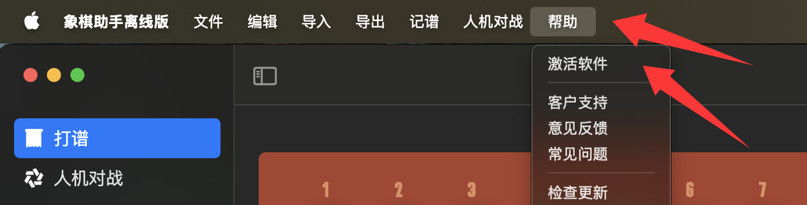
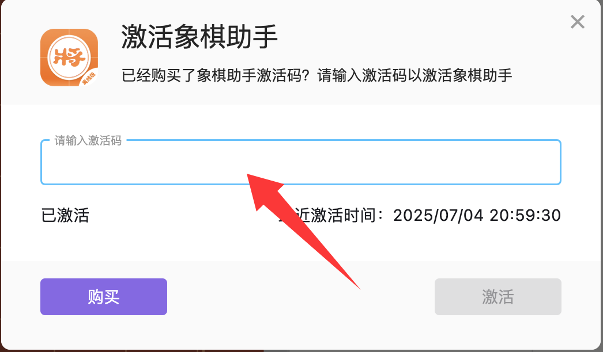

# 激活码使用说明
### 什么是激活码？
激活码主要是用于激活你的象棋助手离线版软件，只有激活后，你才能使用象棋助手离线版的全部功能。

### 如何激活
如下图所示，点击顶部菜单栏“帮助-激活软件”，会弹出一个如图所示的弹窗，在弹窗的输入框内输入你的激活码，点击“激活”即可完成激活。

### 是否每次启动都需要激活？
是的！但只要你激活过一次，并且未卸载过软件，下次打开后，软件会自动联网激活，无需手动处理。因此，请注意在软件启动时，保持网络畅通，一旦激活后就不再需要网络了！

### 激活码忘记怎么办？
在你购买激活码的时候，我们会要求输入邮箱，你可以先尝试查找邮箱的历史记录，确认激活码是否可以找到。如果没有找到，请提供当时购买的订单号并联系微信客服（ouyangfeng_office）处理。

### 绑定限制
一个激活码最多绑定3台设备，超出将无法激活！

### 设备停用怎么办？
如果你的某台设备已经不再使用，但曾经使用激活码绑定过这台设备，而导致当前绑定设备已经达到最大限额3台设备。如果你确定这台设备你已经不在使用，你可以点击设置，找到“设备管理”，找到这台设备的信息，并且复制设备ID发送给微信客服（ouyangfeng_office）申请标记该设备已经停用。停用该设备后将会多出一个名额，你可以继续激活你的新设备！

请注意：这个操作是不可逆的！一旦标记设备不再使用，你将永远无法在这台设备上面使用象棋助手。因此，进行该操作前务必确定当前设备已经不再使用！否则，切勿轻易操作！切记！切记！切记！