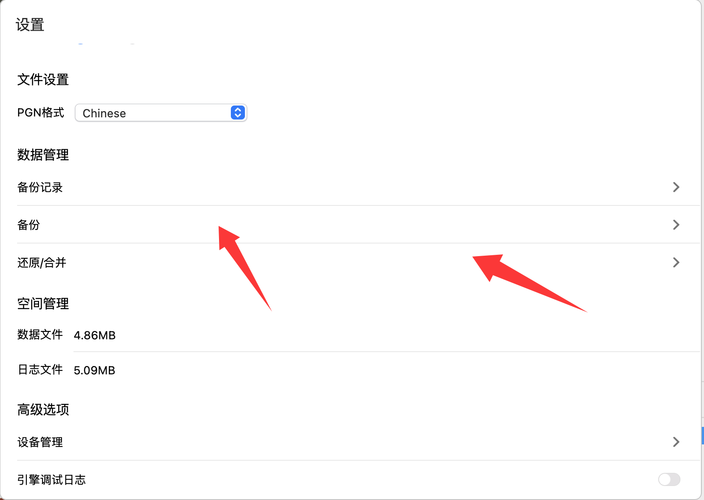

# 备份与还原
> 由于象棋助手离线版的所有棋谱数据都只存在于你的设备。因此，它可能会因为你不小心删除或格式化设备而导致数据丢失。因此，请一定要记得定时备份数据。

### 如何备份数据？
备份数据非常简单，点击左上角菜单，依次点击“文件”、“设置”，在设置里面找到数据管理，在数据管理区域的下方，有一个“备份”的按钮，点击该按钮，会让你选择备份文件夹，选择完成后，会立即开始备份，
备份完成后，会生成一个cab后缀的备份文件，这个就是象棋助手的备份文件。你可以将这个文件保存到你的移动硬盘或者其它不容易丢失或者误删的地方。

### 如何恢复数据？
象棋助手的恢复数据设计的比较巧妙，严格意义上来讲，应该叫做合并数据，恢复数据不会删除你已经保存的数据，而会导入到象棋助手中。因此，称之为合并更加合适。
操作方法也非常简单，同样在“数据管理”的下方，点击“还原/合并”数据，等待完成即可完成数据的还原。