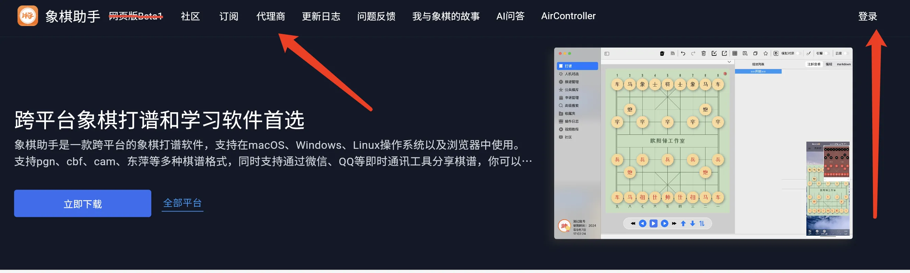
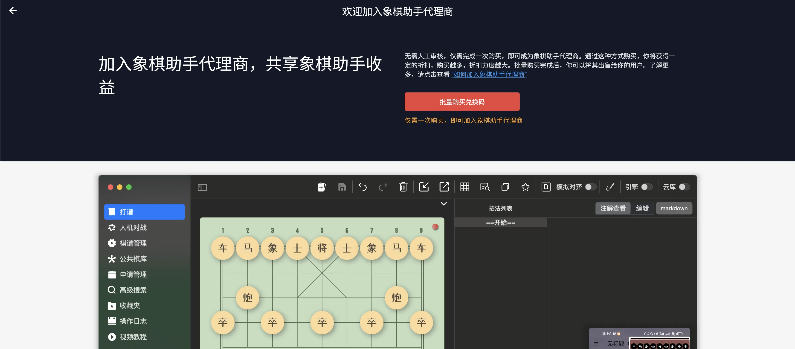
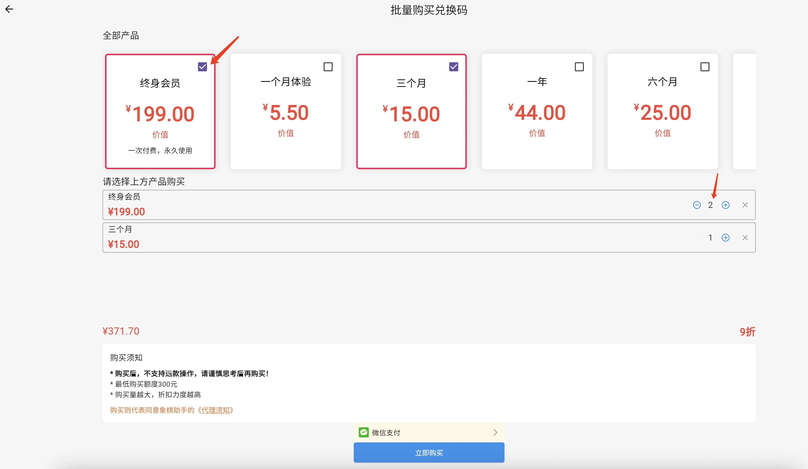
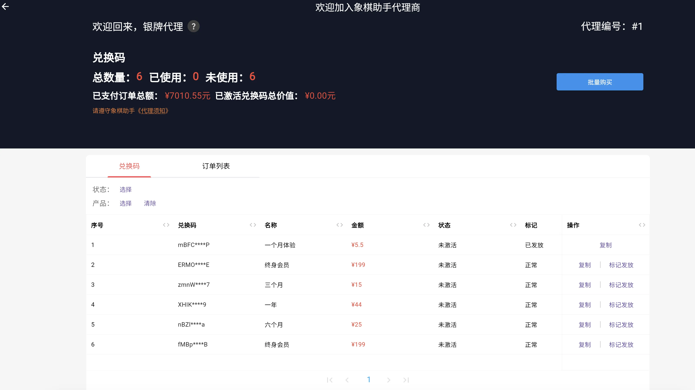
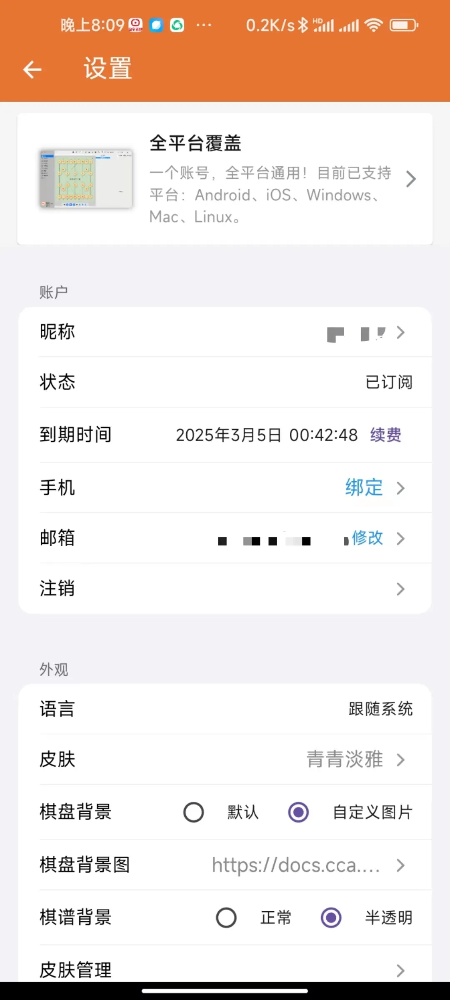
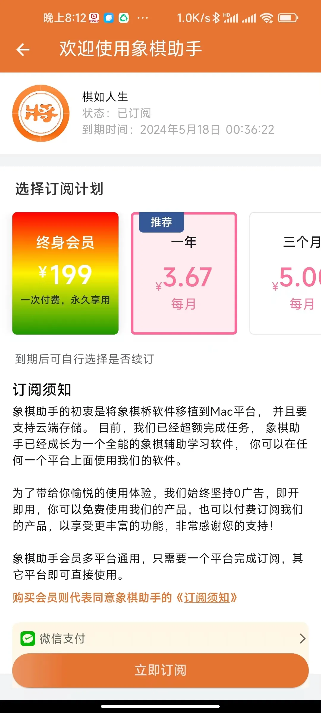
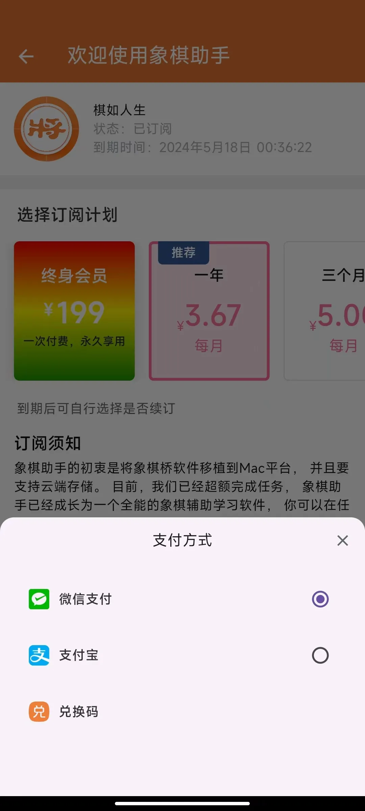
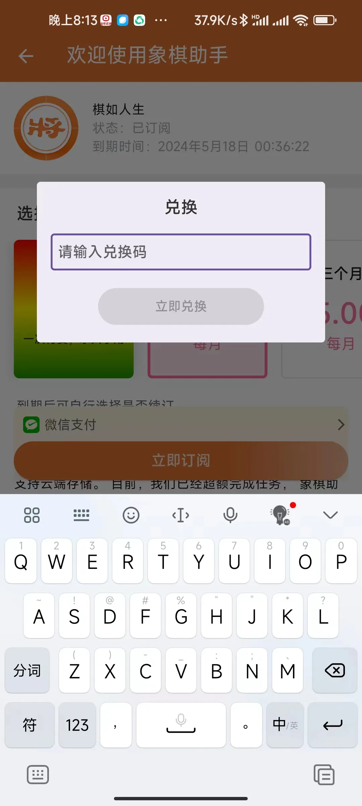
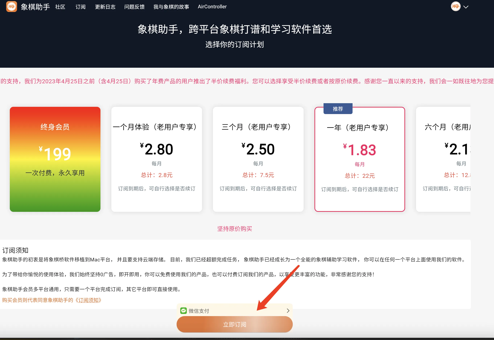

本文将给大家介绍，如何成为象棋助手代理商，以及如何进行管理和销售象棋助手会员，在文章开始之前，先给大家简单介绍一下象棋助手代理商。

## 什么是象棋助手代理商？

所谓的象棋助手代理商，即你可以同象棋助手官方一样，销售象棋助手会员产品。象棋助手代理商无需人工审核，完成一次批量购买即可自动成为我们的代理商。

## 成为代理商有什么好处？

答案显而易见！成为代理商，你可以共享象棋助手的收益，在象棋助手批量拿货，你将获得很大的折扣力度，拿到货后，你可以制定自己的折扣力度，例如：拿货价是7折，你可以通过8折的方式卖出去，中间就可以获得1折的收益。

## 具体的折扣力度如下：

不同代理等级享受的折扣力度不一样：

-   🥉铜牌代理：默认等级，不享受折扣
-   🥈银牌代理：不管购买量大小，均可享受7折购买
-   🏅金牌代理：不管购买量大小，均可享受5折购买

 

不同购买量，折扣力度也不一样：

-   购买量小于1000，可享受8.5折
-   购买量大于1000且小于5000，可享受8折
-   购买量大于5000且小于10000，可享受7折
-   购买量达到10000及以上可享受5折

 

以上两种折扣同时存在的情况下，以最大的折扣为准，例如：银牌代理购买量超过了10000以上，尽管银牌代理折扣只能达到7.5折，但由于购买量超过了10000， 依然可以享受5折优惠购买。同样地，如果金牌代理购买量只有300，仍然可以享受5折购买的优惠。

 

## 如何成为象棋助手代理商

目前，成为象棋助手代理商非常简单，无需人工审核，仅需完成一次批量购买，即可自动成为象棋助手代理商，具体操作方法如下：

使用电脑打开象棋助手官网https://cca.yhdm360.cn, 打开后，你将看到如下画面：

​

首先点击右侧按钮登录，登录成功后，继续回到首页，点击第一个箭头位置所示菜单“代理商”，即可看到如下画面：

​

看到如上图所示画面，证明你目前还不是象棋助手代理商，点击上图中“批量购买兑换码”按钮，进入批量购买兑换码页面：

​

点击“全部产品”下面的复选框，选择你想要售卖的产品，选中后，可修改对应产品右侧的产品数量，整个过程中，订单的价格以及折扣将会自动计算，稍微等待一会即可看到订单总价以及折扣。

完成购买后，再次进入代理商首页，你将看到如下所示页面：

​

## 将产品发放给你的用户

接下来，你就可以将兑换码发放给你的用户了，你可以在闲鱼、淘宝或者QQ群推广你的产品，假如你的用户购买了“一个月体验”的会员产品。那么，你可以点击表格中“操作”一栏下方的“复制”按钮，复制兑换码。然后，

粘贴到你的聊天工具发送给你的用户。

发放给你的用户之后，可点击右侧“标记发放”按钮，标记当前兑换码已经发放给用户，以避免反复多次重复发放。

 

通过以上步骤，即完成了整个产品的购买、管理以及销售过程，通过制定不同的折扣，即可获得相应的收益。

 

## 激活兑换码

当然，完成发放后，可能部分棋友不知道如何激活，会向你咨询激活相关事宜。那么，接下来就给大家讲解，如何使用兑换码激活象棋助手会员产品。

这里要分两种情况，如果是Android手机，当然非常简单。

**首先，确保你的App版本已经更新到了0.5.0，如果没有，可前往小米市场、应用宝或者象棋助手官网下载安装最新版本。**

​

接下来，点击左侧Tab切换到设置页面，如果你还没有购买过象棋助手会员，到期时间右侧，会显示“订阅”，已经购买过，则显示续费。这里，我们点击续费，即可切换到订阅页面：

​

点击浅黄色条所在位置，即这里的微信支付，即可看到如下弹窗：

​

这个时候，点击兑换码，会出现一个弹窗，要求输入兑换码。此时，输入正确的兑换码，即可完成兑换：

​
 
通过以上几个步骤，即可完成通过兑换码购买象棋会员的操作。

 

以上是Android设备的操作流程，如果是iOS端或者电脑端软件，则稍微麻烦一点，我们需要通过官网完成兑换。

由于我们的账号是通用，因此，我们只需要打开象棋助手官网<https://cca.yhdm360.cn>，点击右上角登录，登录同一个账号。登录后，点击首页上方菜单“订阅”，即可进入网页端的订阅页面：

​

打开后，同样点击浅黄色条所在位置，点击后，即可看到一个支付方式选择弹窗，我们选择兑换码：

​

​

接下来，同Android端一样，输入兑换码，即可完成兑换。完成兑换后，退出你的iOS app或者你的电脑端app，重新使用刚刚网页端登录的账号登录即可。

## 账号互通说明

注意，这里如果网页端是使用新版微信扫码登录的话，手机端默认的微信登录与网页端的微信登录是不一致的，手机端的微信登录等同于网页端的旧版微信登录，这里推荐在网页端绑定一个邮箱或者手机号。然后手机端使用手机号或者邮箱登录即可。

具体的原因，请参考文章：[手机微信登录与电脑端同步问题](https://static.cca.yhdm360.cn/faq/%E6%89%8B%E6%9C%BA%E5%BE%AE%E4%BF%A1%E7%99%BB%E5%BD%95%E4%B8%8E%E7%94%B5%E8%84%91%E7%AB%AF%E5%90%8C%E6%AD%A5%E9%97%AE%E9%A2%98)

# 了解更多
* [代理须知](https://docs.qq.com/doc/DRUxZdFdJaFlmeXZv)

​