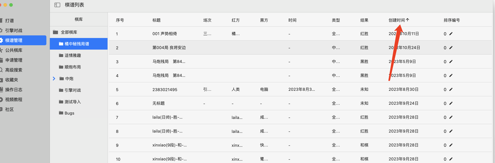
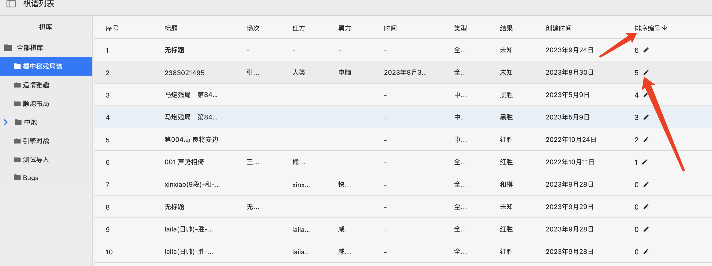

针对棋友@晴雨光阴反馈的棋谱批量导入未按顺序排列问题，本次0.7.3版本推出了针对私人棋谱的排序功能，你可以根据棋谱的**创建时间**、**比赛时间**进行排序，操作方法如下：

切换到“棋谱管理”标签页，选中某棋库，在棋谱列表的标题栏上，以创建时间为例，点击标题栏上的创建时间，即可切换排序方式。

​

如上图所示，“橘中秘残局谱”已经切换到按创建时间升序排序，即创建时间越早，棋谱越靠前。如果要切换为按创建时间降序排序，只需要再点击一次“创建时间”即可。

同样地，你还可以点击表头的“时间”栏，切换为根据比赛时间进行升序或者降序排列。

 

## 自定义排序

如果以上两种排序方式还不能满足你的要求，请看表头最后一项“排序编号”，这是专门为你设计的，以满足有特殊排序要求的棋友使用，点击排序编号下方数字右侧的编辑图标，针对不同棋谱，输入不同的编号，以便实现按排序编号升/降排列。

看下图：

​

在“橘中秘残局谱“中，针对不同棋谱，我输入了不同的编号，这样我就可以按照编号的进行升降序排列了，也就实现了任意我想要的棋谱顺序效果。

## 强烈推荐
针对这个问题，我们已经发布了一个更详细的演示视频，推荐大家前往观看，[点击观看视频](https://www.douyin.com/video/7495613752230825231)

## 附录

微信公众号：1XCode

QQ交流群：725840654

​