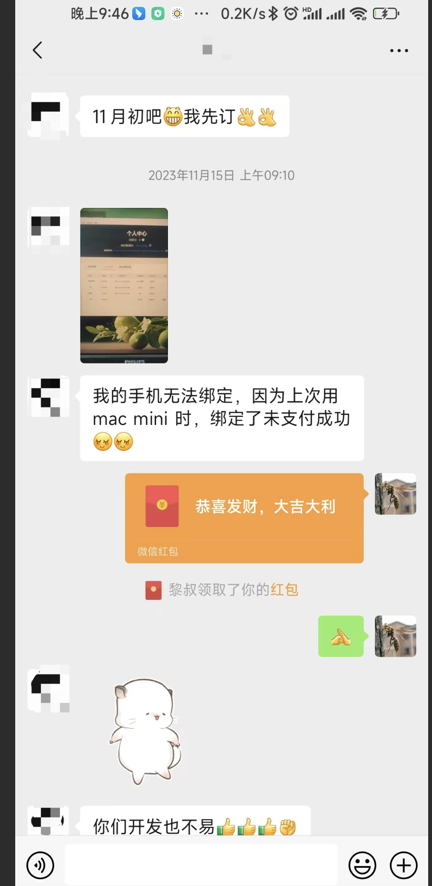

2022年6月28日，我独自一人坐上了前往哈尔滨的飞机，这是我第一次真正地出去旅游。工作这么多年以来，基本上都在忙于工作，可以说把生命献给了老板。在深圳工作9年，除深圳以外的其它城市都没有去过，甚至近在咫尺的香港都没有去过。这一天，我真的想出去走走了，顺便找找灵感，我提前跟远在哈尔滨的小郭约定，我们哈尔滨见。

​

​

这是当时在哈尔滨旅游拍摄的一些照片，我个人很喜欢东北，东北人幽默、热情、不矫情。还记得到东北的第一天，刚睡下，不到一会，天就亮了，一看时间，才3点，很神奇！

也就是在东北旅游的第二天，我突发奇想，要不做一个苹果电脑上的象棋桥吧。作为一个爱棋如命的人，我自己又是苹果电脑的死忠粉，搜索了半天也没能找到Mac平台上可以替代象棋桥的软件。于是，我找来了小郭，跟他说了这个想法。小郭说，这个产品似乎太小众了。小郭的回复当然在我的意料之中，这类软件的确太小众了。但我想，或许赚点伙食费应该可以，而且还可以满足自己的需求，何乐而不为呢。但后来的事实证明，小郭说的是对的。

如今一年已经过去了，我们刚刚发布了象棋助手桌面版0.8.7，这个版本已经具备了很多象棋桥没有的功能，并且支持全平台覆盖，同时支持棋谱云端同步，换而言之，我们已经超额完成了任务。与此同时，我们也由当时的兴趣高涨，到现在的心平气和。这同时宣告了一个无可厚非的事实：做象棋软件的确赚不到钱，哪怕大到腾讯这样的企业，亦是如此。只可惜到了此刻，我们才明白这个道理，悔之晚矣。

好在这一路，我们还是收获了一些感动，有人在我们产品刚刚发布不久就订阅了年费支持我们，还有人甚至连续订阅我们的产品来表示支持，这的确给了我们很多动力，也正是因为这些鼓励才让我们坚持到了今天，让我们坚持在无数个漆黑的夜晚坚持写代码到两三点。

老实说，我并非做象棋软件出身，一直到象棋助手之前，从未接触过象棋类软件开发，也从来没想过自己会写一个象棋软件。

也正是因为这样，我在编写象棋助手软件之前，大大低估了象棋软件开发的难度。当我真正开始做象棋软件之后才发现，太TM操蛋了。象棋在中国发展了这么久，居然没有一个真正意义上的棋谱标准规范。所有的“协议规范”，基本都来自于国际象棋，甚至照搬国际象棋，不免让人感觉寒酸。做软件这么久，这种情况还是第一次遇到，我们不得不搜索各种文档，编写各种兼容代码，兼容各种乱七八糟的软件的规范。好在大多数软件都围绕象棋百科网的文档来实现，八九不离十，基本还能做到勉强兼容。但象棋百科网的文档其实也就一页而已，并不是特别详细，很多东西都需要自己去猜，编写代码的过程中，经常是气的想骂娘。

现在，回过头再来看，尽管象棋助手还未达到当初制定的稳定版，但已经开始后悔了，我后悔不该做这种软件，象棋软件本身比较复杂，还吃力不讨好。大多数棋友并非想要一个可以学习下棋的软件，而是一个支持引擎，可以作弊，拿捏身边朋友或者街边虐大爷炫耀的软件，这完全不符合我们设计的初衷，我也完全没有兴趣去迎合这类需求。

但我想，至少，还有理解我们的棋友，还有每天给我们提出建议的棋友们，还有喜欢我们软件，并使用我们的软件不断提升自己棋力的棋友，这就够了！

但如果，再给我一次机会选择的话，我绝对不会再做象棋软件，甚至连碰都不会去碰，好好下下棋得了！

接下来，我们将把重心转移到可以赚钱的项目中去，象棋助手将开始佛系更新，毕竟我们也要生活，感谢棋友们的理解，预祝大家新年快乐，龙年更上一层楼。

​